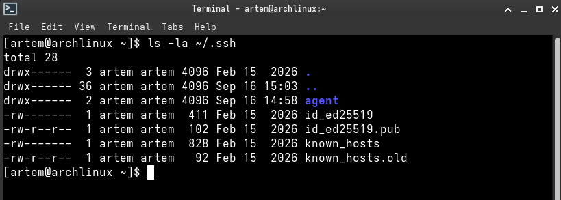
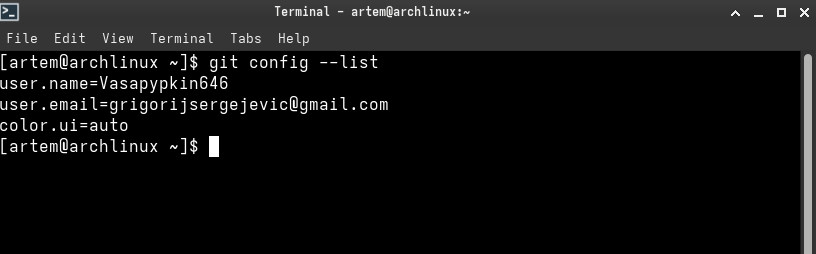
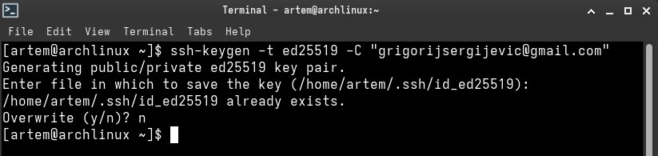
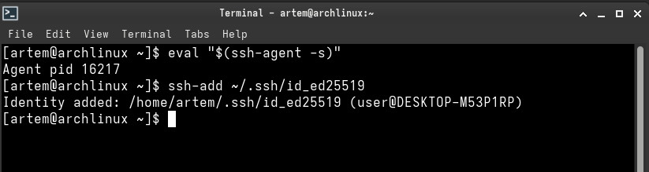
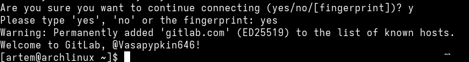
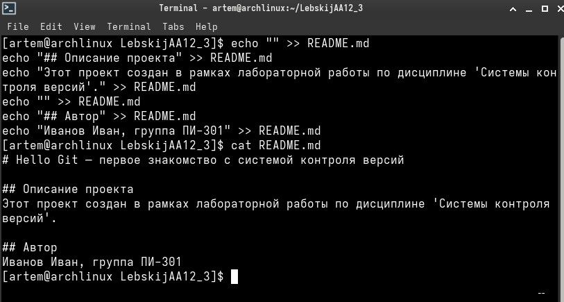
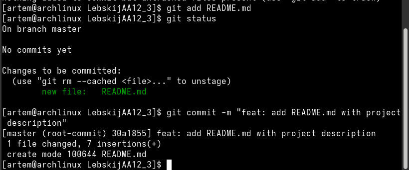
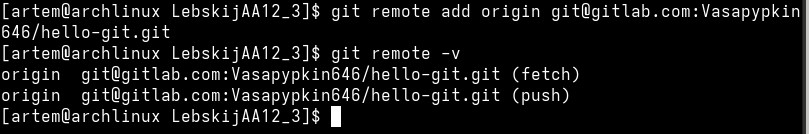
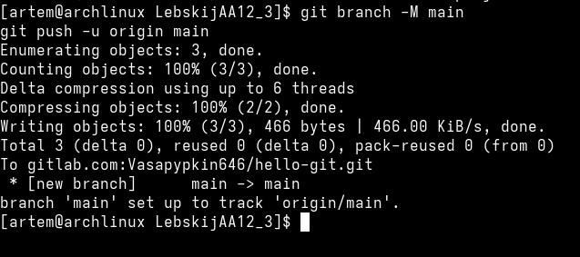
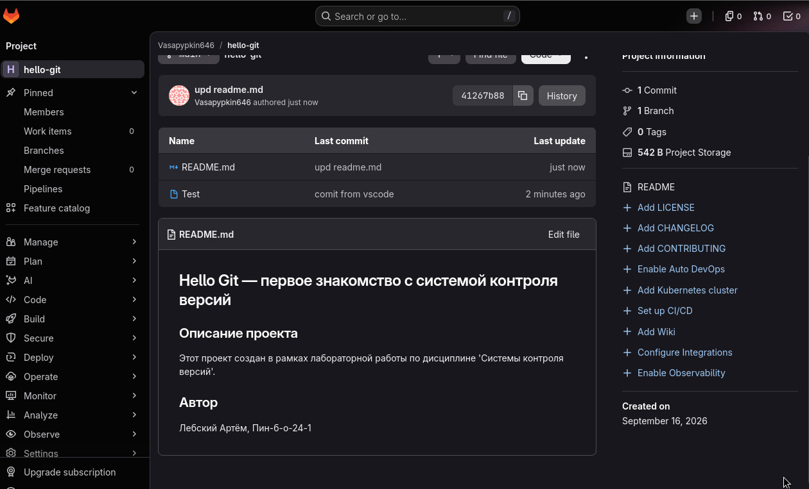

# **Отчет по лабораторной работе №1: «Установка и настройка Git, создание SSH-ключа, работа с GitLab»**

## **Сведения о студенте**
**Дата:** 2026-09-16
**Семестр:** 3 курс, 5 семестр
**Группа:** Пин-б-о-24-1
**Дисциплина:** Системы контроля версий
**Студент:** Лебский Артём Александрович

### **Структура готового проекта**
```
LebskijAA12\_3/  
├── .git/               \# Каталог локальной базы данных репозитория Git  
├── README.md           \# Документация проекта со сведениями об авторе  
└── Test                \# Файл, созданный при синхронизации через VS Code
```
### **Ссылка на репозиторий GitLab**
```
https://gitlab.com/Vasapypkin646/hello-git
```

### **1\. ЦЕЛЬ РАБОТЫ**

> 1. Настроить систему контроля версий Git в операционной системе семейства Linux (Arch Linux).  
> 2. Сгенерировать пару криптографических SSH-ключей алгоритма ed25519 для безопасного взаимодействия с платформой GitLab.  
> 3. Добавить открытый ключ в профиль GitLab и выполнить проверку удалённого SSH-соединения.  
> 4. Инициализировать локальный Git-репозиторий, освоить добавление файлов в индекс (git add) и фиксацию снимков состояния (git commit).  
> 5. Связать локальный репозиторий с удалённым репозиторием на GitLab (git remote add) и выгрузить изменения на сервер (git push).  
> 6. Освоить базовые принципы синхронизации изменений и работу с удалённым хостингом кодовой базы.

### **2\. ЗАДАЧИ РАБОТЫ**

**Выполнены следующие задачи:**

> 1. Проверка рабочей директории хранения SSH-ключей \~/.ssh/.  
> 2. Задание глобальной конфигурации пользователя Git (user.name, user.email, color.ui).  
> 3. Формирование ключевой пары ed25519 с комментарием почтового адреса через утилиту ssh-keygen.  
> 4. Запуск агента аутентификации ssh-agent и добавление закрытого ключа командой ssh-add.  
> 5. Размещение публичной части ключа id\_ed25519.pub в учётной записи GitLab.  
> 6. Верификация сетевого подключения по протоколу SSH с сервером gitlab.com.  
> 7. Создание файла документации README.md с описанием проекта и сведениями об авторе.  
> 8. Индексация изменений и создание коммита в соответствии с соглашением Conventional Commits.  
> 9. Создание удалённого проекта hello-git на веб\-платформе GitLab.  
> 10. Подключение удалённого репозитория под именем origin по SSH-протоколу.  
> 11. Переименование текущей ветки в main и отправка первого набора данных командой git push \-u origin main.  
> 12. Контрольная проверка отображения файлов проекта и истории коммитов в веб\-интерфейсе GitLab.

### **3\. ХОД ВЫПОЛНЕНИЯ РАБОТЫ**

#### **3.1. Проверка директории SSH-ключей**

Перед генерацией новых параметров аутентификации было проверено текущее состояние каталога \~/.ssh/ с помощью команды ls \-la:
```
ls \-la \~/.ssh
```
Вывод команды в терминале:
```
[artem@archlinux \~\]$ ls \-la \~/.ssh  
total 28  
drwx------  3 artem artem 4096 Feb 15  2026 .  
drwx------ 36 artem artem 4096 Sep 16 15:03 ..  
drwx------  2 artem artem 4096 Sep 16 14:58 agent  
-rw-------  1 artem artem  411 Feb 15  2026 id\_ed25519  
-rw-r--r--  1 artem artem  102 Feb 15  2026 id\_ed25519.pub  
-rw-------  1 artem artem  828 Feb 15  2026 known\_hosts  
-rw-r--r--  1 artem artem   92 Feb 15  2026 known\_hosts.old
```
#### **3.2. Настройка глобального профиля пользователя Git**

Для корректной идентификации автора всех будущих коммитов были заданы параметры имени user.name, адреса электронной почты user.email и подсветки синтаксиса интерфейса color.ui:
```
git config \--global user.name "Vasapypkin646"  
git config \--global user.email "grigorijsergejevic@gmail.com"  
git config \--global color.ui auto
```
Проверка внесённых значений выполнена командой:
```
git config \--list
```
Вывод команды в терминале:

```
[artem@archlinux \~\]$ git config \--list  
user.name=Vasapypkin646  
user.email=grigorijsergejevic@gmail.com  
color.ui=auto
```

#### **3.3. Создание ключевой пары SSH**

Для установки безопасного сетевого туннеля с сервером GitLab инициирован процесс создания пары ключей современного криптографического стандарта ed25519:
```
ssh-keygen \-t ed25519 \-C "grigorijsergijevic@gmail.com"
```
Вывод команды в терминале:
```
[artem@archlinux \~\]$ ssh-keygen \-t ed25519 \-C "grigorijsergijevic@gmail.com"  
Generating public/private ed25519 key pair.  
Enter file in which to save the key (/home/artem/.ssh/id\_ed25519):&nbsp;  
/home/artem/.ssh/id\_ed25519 already exists.  
Overwrite (y/n)? n
```
Так как ключ уже был сгенерирован и настроен ранее, при запросе перезаписи выбран ответ n.

#### **3.4. Инициализация демона ssh-agent и регистрация закрытого ключа**

Для хранения ключа в оперативной памяти и автоматического прохождения аутентификации запущен фоновый процесс ssh-agent, после чего приватный ключ id\_ed25519 передан утилите ssh-add:
```
eval "$(ssh-agent \-s)"  
ssh-add \~/.ssh/id\_ed25519
```
Вывод команд в терминале:
```
[artem@archlinux \~\]$ eval "$(ssh-agent \-s)"  
Agent pid 16217  
[artem@archlinux \~\]$ ssh-add \~/.ssh/id\_ed25519  
Identity added: /home/artem/.ssh/id\_ed25519 (user@DESKTOP-M53P1RP)
```
#### **3.5. Привязка публичного ключа и проверка связи с сервером GitLab**

> 1. Открытый ключ из файла \~/.ssh/id\_ed25519.pub скопирован и добавлен в настройках профиля GitLab (**Preferences** → **SSH Keys**).  
> 2. Выполнена сетевая верификация доступа по протоколу SSH:
```
ssh \-T git@gitlab.com
```
Вывод команды в терминале:
```
Are you sure you want to continue connecting (yes/no/\[fingerprint\])? y  
Please type 'yes', 'no' or the fingerprint: yes  
Warning: Permanently added 'gitlab.com' (ED25519) to the list of known hosts.  
Welcome to GitLab, @Vasapypkin646\!  
\[artem@archlinux \~\]$&nbsp;
```
#### **3.6. Создание структуры файла README.md**

В каталоге проекта LebskijAA12\_3 сформирован файл документации README.md с помощью потокового вывода команд echo и проверен через утилиту cat:
```
echo "\# Hello Git — первое знакомство с системой контроля версий" \> README.md  
echo "" \>\> README.md  
echo "\#\# Описание проекта" \>\> README.md  
echo "Этот проект создан в рамках лабораторной работы по дисциплине 'Системы контроля версий'." \>\> README.md  
echo "" \>\> README.md  
echo "\#\# Автор" \>\> README.md  
echo "Лебский Артём, Пин-б-о-24-1" \>\> README.md  
cat README.md
```
Вывод команд в терминале:
```
[artem@archlinux LebskijAA12\_3\]$ echo "" \>\> README.md  
[artem@archlinux LebskijAA12\_3\]$ echo "\#\# Описание проекта" \>\> README.md  
[artem@archlinux LebskijAA12\_3\]$ echo "Этот проект создан в рамках лабораторной работы по дисциплине 'Системы контроля версий'." \>\> README.md  
[artem@archlinux LebskijAA12\_3\]$ echo "" \>\> README.md  
[artem@archlinux LebskijAA12\_3\]$ echo "\#\# Автор" \>\> README.md  
[artem@archlinux LebskijAA12\_3\]$ echo "Иванов Иван, группа ПИ-301" \>\> README.md  
[artem@archlinux LebskijAA12\_3\]$ cat README.md  
# Hello Git — первое знакомство с системой контроля версий
```
\#\# Описание проекта  
Этот проект создан в рамках лабораторной работы по дисциплине 'Системы контроля версий'.

\#\# Автор  
Иванов Иван, группа ПИ-301

#### **3.7. Индексация данных и создание первого коммита**

Файл README.md добавлен в область подготовки к коммиту (staging area), проверен текущий статус репозитория и зафиксировано исходное состояние проекта:
```
git add README.md  
git status  
git commit \-m "feat: add README.md with project description"
```
Вывод команд в терминале:
```
[artem@archlinux LebskijAA12\_3\]$ git add README.md  
[artem@archlinux LebskijAA12\_3\]$ git status  
On branch master

No commits yet

Changes to be committed:  
&nbsp;&nbsp;(use "git rm \--cached \<file\>..." to unstage)  
&nbsp;new file:   README.md

[artem@archlinux LebskijAA12\_3\]$ git commit \-m "feat: add README.md with project description"  
[master (root-commit) 30a1855\] feat: add README.md with project description  
&nbsp;1 file changed, 7 insertions(+)  
&nbsp;create mode 100644 README.md
```
#### **3.8. Привязка удалённого репозитория GitLab**

На сервере GitLab создан пустой репозиторий hello-git. Локальный проект связан с адресом удалённого узла под псевдонимом origin:
```
git remote add origin git@gitlab.com:Vasapypkin646/hello-git.git  
git remote \-v
```
Вывод команд в терминале:
```
[artem@archlinux LebskijAA12\_3\]$ git remote add origin git@gitlab.com:Vasapypkin646/hello-git.git  
[artem@archlinux LebskijAA12\_3\]$ git remote \-v  
origin  git@gitlab.com:Vasapypkin646/hello-git.git (fetch)  
origin  git@gitlab.com:Vasapypkin646/hello-git.git (push)
```

#### **3.9. Переименование ветки и публикация изменений (push)**

Основная ветка переименована в main через ключ \-M, после чего выполнена отправка данных в удалённую ветку с установкой связи отслеживания (-u):
```
git branch \-M main  
git push \-u origin main
```
Вывод команд в терминале:
```
[artem@archlinux LebskijAA12\_3\]$ git branch \-M main  
[artem@archlinux LebskijAA12\_3\]$ git push \-u origin main  
Enumerating objects: 3, done.  
Counting objects: 100% (3/3), done.  
Delta compression using up to 6 threads  
Compressing objects: 100% (2/2), done.  
Writing objects: 100% (3/3), 466 bytes | 466.00 KiB/s, done.  
Total 3 (delta 0), reused 0 (delta 0), pack-reused 0 (from 0\)  
To gitlab.com:Vasapypkin646/hello-git.git  
&nbsp;\* \[new branch\]      main \-\> main  
branch 'main' set up to track 'origin/main'.
```
#### **3.10. Синхронизация и финальное состояние репозитория**

В ходе дальнейшей работы через редактор VS Code в проект был добавлен проверочный файл Test с сообщением коммита "comit from vscode", а также обновлён файл README.md коммитом "upd readme.md" (хэш 41267b88) с актуальными данными автора: Лебский Артём, Пин-б-о-24-1.

### **4\. СКРИНШОТЫ ВЫПОЛНЕНИЯ РАБОТЫ**

> * **Скриншот 1:** Проверка содержимого каталога \~/.ssh/ и существующих ключей. 

> * **Скриншот 2:** Просмотр глобальной конфигурации пользователя утилитой git config \--list.  

> * **Скриншот 3:** Вызов генерации криптографической пары ключей через ssh-keygen.  

> * **Скриншот 4:** Инициализация фонового демона ssh-agent и добавление ключа в память (ssh-add).  

> * **Скриншот 5:** Тестирование сетевой доступности и SSH-аутентификации на сервере gitlab.com.  

> * **Скриншот 6:** Создание и проверка содержимого файла README.md утилитой cat.  

> * **Скриншот 7:** Добавление файла в область Staging (git add) и фиксация первого коммита (git commit).  

> * **Скриншот 8:** Подключение удалённого репозитория GitLab командой git remote add.  

> * **Скриншот 9:** Переименование ветки в main и отправка коммитов в удалённый репозиторий (git push).  

> * **Скриншот 10:** Отображение опубликованного проекта Vasapypkin646 / hello-git в веб\-интерфейсе GitLab.


### **5\. ОТВЕТЫ НА КОНТРОЛЬНЫЕ ВОПРОСЫ**

#### **1\. Что такое распределённая система контроля версий и чем она отличается от централизованной?**

В централизованных системах контроля версий (CVCS, например Subversion, CVS) имеется единый сервер, на котором хранится полная база данных всех изменений. Разработчики выгружают себе только рабочую копию текущего среза файлов. В случае отсутствия сетевого подключения или выхода центрального сервера из строя невозможно фиксировать новые коммиты, просматривать историю или переключать ветки.

В распределённых системах (DVCS, таких как Git) каждый участник разработки клонирует к себе локально полную копию всего репозитория, содержащую историю коммитов, все ветки и теги. Вся повседневная работа ведётся локально и автономно, а центральные серверы (например, GitLab) используются лишь как координационные центры для обмена кодом между разработчиками.

#### **2\. Для чего нужен SSH-ключ при работе с GitLab?**

SSH-ключ применяется для безопасной асимметричной аутентификации клиента на удалённом сервере GitLab без необходимости постоянного ручного ввода паролей или одноразовых токенов при выполнении операций git push, git pull и git fetch.

Механизм основан на паре криптографических ключей:

> * **Закрытый (приватный) ключ** хранится локально на рабочей станции пользователя с правами доступа 600;  
> * **Открытый (публичный) ключ** загружается в учётную запись на сервере GitLab.

При подключении сервер шифрует контрольные данные открытым ключом, а клиент подтверждает свою подлинность успешной расшифровкой при помощи закрытого ключа.

#### **3\. В чём разница между git add и git commit?**

> * Команда git add переводит выбранные изменения из рабочего каталога (Working Directory) в промежуточную буферную область — индекс (Staging Area). Команда определяет, какие файлы попадут в следующий моментальный снимок состояния.  
> * Команда git commit берет подготовленный набор файлов из Staging Area и сохраняет его в постоянную базу данных репозитория в виде неизменяемого объекта коммита с метаданными (автор, почта, временная метка, родительский коммит, уникальный SHA-хэш).

#### **4\. Что такое staging area (индекс) в Git?**

Staging Area (индекс) — это промежуточная фаза подготовки изменений между рабочим каталогом разработчика и постоянной историей коммитов. Индекс необходим для формирования атомарных коммитов: если в проекте модифицировано несколько несвязанных между собой участков кода, с помощью поочередного добавления файлов в Staging Area их можно разделить на логически обособленные фиксации.

#### **5\. Как проверить, какие файлы были изменены, но ещё не добавлены в коммит?**

Для анализа текущего состояния рабочей зоны используются команды:

> 1. Сводный просмотр состояния репозитория:
```
git status
```
Команда выводит список изменённых, но ещё не добавленных в индекс файлов (секция *Changes not staged for commit*), а также новые неотслеживаемые файлы (*Untracked files*).

> 2. Построчный просмотр различий:
```
git diff
```
Команда отображает точную разницу между текущим содержимым файлов на накопителе и состоянием, находящимся в индексе Staging Area.

#### **6\. Для чего нужен файл .gitignore? Приведите примеры.**

Файл .gitignore сообщает системе Git, какие шаблоны файлов и директорий следует исключать из отслеживания. Это предотвращает случайную отправку в репозиторий временных файлов, логов, бинарных файлов сборки, зависимостей и секретных данных.

Пример типового содержимого файла .gitignore:
```
\# Системные файлы операционных систем  
.DS\_Store  
Thumbs.db

\# Журналы и временные файлы  
\*.log  
\*.tmp

\# Директории внешних библиотек и зависимостей  
node\_modules/  
vendor/

\# Артефакты компиляции и сборки  
dist/  
build/  
\*.bin  
\*.class

\# Файлы локальных конфигураций и секретов  
.env  
.env.local

\# Папки настроек интегрированных сред разработки (IDE)  
.vscode/  
.idea/
```
#### **7\. Как связать локальный репозиторий с удалённым?**

Для связывания используется команда добавления удалённого узла (remote), где указывается его псевдоним (по соглашению используется origin) и сетевой URL-адрес:
```
git remote add origin git@gitlab.com:Vasapypkin646/hello-git.git
```
Проверка списка и адресов подключённых удалённых узлов выполняется командой:
```
git remote \-v
```
#### **8\. Чем отличается git fetch от git pull?**

> * git fetch связывается с удалённым репозиторием и загружает недостающие коммиты, теги и ветки в локальную базу данных, обновляя удалённые указатели (например, origin/main). При этом рабочие файлы в текущей локальной ветке остаются без изменений.  
> * git pull является составной операцией: он сначала запускает git fetch для скачивания обновлений с сервера, а затем автоматически выполняет слияние (git merge) или перебазирование (git rebase) этих изменений в текущую локальную ветку.

### **6\. ИСПОЛЬЗУЕМЫЕ КОМАНДЫ**

Сводный список консольных команд, применённых в ходе выполнения лабораторной работы:
```
\# Навигация и работа с криптографическими SSH-ключами  
ls \-la \~/.ssh  
ssh-keygen \-t ed25519 \-C "grigorijsergijevic@gmail.com"  
eval "$(ssh-agent \-s)"  
ssh-add \~/.ssh/id\_ed25519  
ssh \-T git@gitlab.com

\# Глобальное конфигурирование Git  
git config \--global user.name "Vasapypkin646"  
git config \--global user.email "grigorijsergejevic@gmail.com"  
git config \--global color.ui auto  
git config \--list

\# Локальная работа с репозиторием  
git init  
git add README.md  
git status  
git commit \-m "feat: add README.md with project description"  
git branch \-M main

\# Взаимодействие с удалённым репозиторием GitLab  
git remote add origin git@gitlab.com:Vasapypkin646/hello-git.git  
git remote \-v  
git push \-u origin main
```
### **7\. ВЫВОДЫ**

В ходе выполнения лабораторной работы были всесторонне изучены и отработаны практические навыки администрирования версий проекта с помощью распределённой системы Git и хостинга GitLab:

> 1. Произведена настройка глобального профиля пользователя с указанием авторских метаданных (user.name, user.email) и подсветки терминала (color.ui).  
> 2. Организовано безопасное криптографическое подключение к сервису GitLab с применением пары ключей алгоритма ed25519, демона ssh-agent и утилиты ssh-add.  
> 3. Освоен практический цикл фиксации версий: инициализация репозитория (git init), создание и наполнение файла README.md, перевод правок в область Staging (git add) и создание коммита (git commit) по стандарту Conventional Commits.  
> 4. Выполнена привязка локального репозитория к удалённому узлу origin и отправка изменений в основную ветку main с помощью команды git push \-u origin main.  
> 5. Проверено и подтверждено итоговое состояние проекта в веб\-интерфейсе GitLab, включая последующую синхронизацию изменений через VS Code.