# **Отчет по лабораторной работе №2: «Ветвление, слияние и разрешение конфликтов в Git»**

## **Сведения о студенте**
**Дата:** 2026-09-16
**Семестр:** 3 курс, 5 семестр
**Группа:** Пин-б-о-24-1
**Дисциплина:** Системы контроля версий
**Студент:** Лебский Артём Александрович

### **Структура готового проекта**
```
LebskijAA12_3/
├── .git/               # Каталог локальной базы данных репозитория Git
├── .gitignore          # Правила исключения временных файлов и директорий IDE
├── README.md           # Документация проекта со сведениями об авторе
├── Test                # Проверочный файл синхронизации через VS Code
├── config.txt          # Конфигурационный файл выбора базы данных
├── diff.txt            # Файл фиксации разницы между коммитами (git diff)
├── features.txt        # Перечень функциональных возможностей системы
└── version.txt         # Файл фиксации версии в релизной ветке (release/v1.0)
```

### **Ссылка на репозиторий GitLab**
```
https://gitlab.com/Vasapypkin646/hello-git
```

### **1. ЦЕЛЬ РАБОТЫ**

> 1. Освоить работу с ветками в Git: создание, переключение, слияние и удаление.  
> 2. Научиться выполнять слияние независимых веток (`git merge`) в различных сценариях.  
> 3. Изучить механизмы возникновения конфликтов слияния и отработать практические навыки их ручного разрешения.  
> 4. Освоить операцию перебазирования (`git rebase`), изучить процесс разрешения конфликтов при `rebase` и сравнить его со стандартным слиянием.  
> 5. Закрепить навыки командной работы и публикации веток на удалённом сервере GitLab, включая создание и слияние Merge Request, а также ведение релизных веток по модели Git Flow.  
> 6. Выполнить комплексное практическое задание для самостоятельной работы: отработать фиксацию фичей, анализ разницы версий (`git diff`), перебазирование и слияние веток.

### **2. ЗАДАЧИ РАБОТЫ**

**Выполнены следующие задачи:**

> 1. Подготовка рабочего репозитория `LebskijAA12_3` и фиксация базового файла `features.txt`.  
> 2. Создание изолированной ветки `feature/payment` и фиксация функционала платежей.  
> 3. Создание второй параллельной ветки `feature/notifications` с внесением изменений в те же строки файла.  
> 4. Выполнение трёхстороннего слияния без конфликта ветки `feature/payment` в `main` с флагом `--no-ff`.  
> 5. Попытка слияния ветки `feature/notifications` и фиксация состояния конфликта содержимого (`Merge conflict`).  
> 6. Анализ конфликтных маркеров и ручное объединение изменений в `features.txt` с созданием merge-коммита.  
> 7. Визуальный анализ графа истории коммитов через встроенные средства Git и панель Source Control в VS Code.  
> 8. Создание ветки `feature/database`, параллельное изменение файла `config.txt` в ветке `main`.  
> 9. Перебазирование ветки `feature/database` на актуальный срез `main` через `git rebase`, настройка текстового редактора `core.editor` и успешное продолжение `rebase (--continue)`.  
> 10. Анализ графа истории коммитов через `git log --oneline --graph --all` и сопоставление линейной истории после `rebase` с ветвлением после `merge`.  
> 11. Публикация веток в удалённый репозиторий GitLab, оформление и слияние Merge Request (!1).  
> 12. Создание релизной ветки `release/v1.0`, добавление файла `version.txt`, отправка на сервер и успешное слияние через Merge Request (!2).  
> 13. Выполнение комплексного самостоятельного задания: добавление фичей в `main`, ветвление `feature/third`, сохранение разницы коммитов в `diff.txt`, перебазирование и синхронизация релизных данных на GitLab.

### **3. ХОД ВЫПОЛНЕНИЯ РАБОТЫ**

#### **3.1. Создание базового файла и первой ветки**

В каталоге проекта `LebskijAA12_3` сформирован файл `features.txt` с базовым набором функций, зафиксирован коммит `55d4363`, после чего создана ветка `feature/payment` и выполнен переход на неё:

```text
git add features.txt
git commit -m "feat: add features.txt with core features"
git branch feature/payment
git checkout feature/payment
git branch
```

Вывод команд в терминале:

```text
[artem@archlinux LebskijAA12_3]$ git add features.txt
git commit -m "feat: add features.txt with core features"
[main 55d4363] feat: add features.txt with core features
 1 file changed, 4 insertions(+)
 create mode 100644 features.txt
[artem@archlinux LebskijAA12_3]$ git branch feature/payment
[artem@archlinux LebskijAA12_3]$ git checkout feature/payment
Switched to branch 'feature/payment'
[artem@archlinux LebskijAA12_3]$ git branch
* feature/payment
  main
```

#### **3.2. Внесение изменений в ветку payment и создание параллельной ветки notifications**

В ветке `feature/payment` добавлены строки с функциями оплаты. Затем выполнен возврат в ветку `main`, создана вторая функциональная ветка `feature/notifications` (через ключ `-b`), в которой файл `features.txt` перезаписан альтернативным списком:

```text
git add features.txt
git commit -m "feat(payment): add payment and history features"
git checkout main
git checkout -b feature/notifications
echo "1. Авторизация с двухфакторной аутентификацией" > features.txt
echo "2. Просмотр профиля с аватаркой" >> features.txt
echo "3. Редактирование профиля" >> features.txt
echo "4. Система уведомлений" >> features.txt
git add features.txt
git commit -m "feat(notifications): add 2FA and notification system"
```

Вывод команд в терминале:

```text
[artem@archlinux LebskijAA12_3]$ git add features.txt
git commit -m "feat(payment): add payment and history features"
[feature/payment c914f11] feat(payment): add payment and history features
 1 file changed, 2 insertions(+)
[artem@archlinux LebskijAA12_3]$ git checkout main
Switched to branch 'main'
Your branch is ahead of 'origin/main' by 1 commit.
  (use "git push" to publish your local commits)
[artem@archlinux LebskijAA12_3]$ git checkout -b feature/notifications
Switched to a new branch 'feature/notifications'
[artem@archlinux LebskijAA12_3]$ echo "1. Авторизация с двухфакторной аутентификацией" > features.txt
echo "2. Просмотр профиля с аватаркой" >> features.txt
echo "3. Редактирование профиля" >> features.txt
echo "4. Система уведомлений" >> features.txt
[artem@archlinux LebskijAA12_3]$ git add features.txt
git commit -m "feat(notifications): add 2FA and notification system"
[feature/notifications ce0df72] feat(notifications): add 2FA and notification system
 1 file changed, 3 insertions(+), 3 deletions(-)
```

#### **3.3. Слияние ветки без конфликта (--no-ff)**

Выполнен переход в ветку `main` и слияние ветки `feature/payment` с принудительным созданием коммита слияния через флаг `--no-ff`. Слияние прошло бесконфликтно по трёхсторонней стратегии `ort`:

```text
git merge feature/payment --no-ff -m "Merge branch 'feature/payment'"
git log --oneline --graph --all
```

Вывод команд в терминале:

```text
[artem@archlinux LebskijAA12_3]$ git merge feature/payment --no-ff -m "Merge branch 'feature/payment'"
Merge made by the 'ort' strategy.
 features.txt | 2 ++
 1 file changed, 2 insertions(+)
[artem@archlinux LebskijAA12_3]$ git log --oneline --graph --all
*   82da9bb (HEAD -> main) Merge branch 'feature/payment'
|\  
| * c914f11 (feature/payment) feat(payment): add payment and history features
|/  
| * ce0df72 (feature/notifications) feat(notifications): add 2FA and notification system
|/  
* 55d4363 feat: add features.txt with core features
* ea50886 (origin/main) chore: add .gitignore
* 41267b8 upd readme.md
* ecc74fb comit from vscode
* 30a1855 feat: add README.md with project description
```

#### **3.4. Возникновение конфликта слияния**

При попытке слить ветку `feature/notifications` в `main` зафиксирован конфликт содержимого (`CONFLICT (content)`), так как обе ветки содержат несовместимые правки одних и тех же строк:

```text
git merge feature/notifications
```

Вывод команды в терминале:

```text
[artem@archlinux LebskijAA12_3]$ git merge feature/notifications
Auto-merging features.txt
CONFLICT (content): Merge conflict in features.txt
Automatic merge failed; fix conflicts and then commit the result.
```

#### **3.5. Диагностика и ручное разрешение конфликта**

Командами `git status` и `cat features.txt` выявлены неразрешённые пути и системные маркеры конфликта:

```text
git status
cat features.txt
```

Вывод команд в терминале:

```text
On branch main
Your branch is ahead of 'origin/main' by 3 commits.
  (use "git push" to publish your local commits)

You have unmerged paths.
  (fix conflicts and run "git commit")
  (use "git merge --abort" to abort the merge)

Unmerged paths:
  (use "git add <file>..." to mark resolution)
	both modified:   features.txt

no changes added to commit (use "git add" and/or "git commit -a")
[artem@archlinux LebskijAA12_3]$ cat features.txt
1. Авторизация с двухфакторной аутентификацией
2. Просмотр профиля с аватаркой
3. Редактирование профиля
<<<<<<< HEAD
4. Оплата банковской картой
5. История платежей
=======
4. Система уведомлений
>>>>>>> feature/notifications
```

Маркеры конфликта удалены, объединённый список сохранён, добавлен в индекс и зафиксирован коммитом слияния `7f0418b`:

```text
git commit -m "merge: resolve conflict between payment and notifications"
git log --oneline --graph --all
```

Вывод команд в терминале:

```text
[artem@archlinux LebskijAA12_3]$ git commit -m "merge: resolve conflict between payment and notifications"

# Проверяем историю
git log --oneline --graph --all
[main 7f0418b] merge: resolve conflict between payment and notifications
*   7f0418b (HEAD -> main) merge: resolve conflict between payment and notifications
|\  
| * ce0df72 (feature/notifications) feat(notifications): add 2FA and notification system
* |   82da9bb Merge branch 'feature/payment'
|\ \  
| |/  
| * c914f11 (feature/payment) feat(payment): add payment and history features
|/  
* 55d4363 feat: add features.txt with core features
* ea50886 (origin/main) chore: add .gitignore
* 41267b8 upd readme.md
* ecc74fb comit from vscode
* 30a1855 feat: add README.md with project description
```

#### **3.6. Визуализация дерева коммитов в VS Code**

Граф коммитов и структура веток были проверены через графический интерфейс редактора VS Code (панель Source Control). Граф коммитов наглядно отображает расхождение веток `feature/payment` и `feature/notifications` от базового коммита `55d4363`, а также их последующее слияние в ветку `main` коммитом `7f0418b`.

#### **3.7. Перебазирование (git rebase) и устранение конфликта**

От ветки `main` создана ветка `feature/database` с конфигурационным файлом `config.txt` (базы SQLite и PostgreSQL). Параллельно в ветке `main` зафиксирован коммит с базой MySQL (`fix(db): change default database to MySQL`).

При попытке выполнить `git rebase main` возник конфликт добавления (`CONFLICT (add/add)`):

```text
git checkout feature/database
git rebase main
```

Вывод команд в терминале:

```text
[artem@archlinux LebskijAA12_3]$ git checkout feature/database
git rebase main
Switched to branch 'feature/database'
Auto-merging config.txt
CONFLICT (add/add): Merge conflict in config.txt
error: could not apply 1b6dccf... feat(db): add database configuration
hint: Resolve all conflicts manually, mark them as resolved with
hint: "git add/rm <conflicted_files>", then run "git rebase --continue".
hint: You can skip this commit: run "git rebase --skip".
hint: To abort and get back to the state before "git rebase", run "git rebase --abort".
hint: Disable this message with "git config set advice.mergeConflict false"
Could not apply 1b6dccf... # feat(db): add database configuration
```

Конфликт в файле `config.txt` разрешён с помощью редактора `nano`, файл подготовлен через `git add`. Для корректной фиксации сообщения коммита в глобальную конфигурацию Git установлен редактор `nano`, после чего команда `git rebase --continue` успешно завершила перебазирование:

```text
nano config.txt
git add config.txt
git rebase --continue
git config --global core.editor nano
git rebase --continue
```

Вывод команд в терминале:

```text
[artem@archlinux LebskijAA12_3]$ nano config.txt
[artem@archlinux LebskijAA12_3]$ git add config.txt
[artem@archlinux LebskijAA12_3]$ git rebase --continue
hint: Waiting for your editor to close the file... error: cannot run vi: No such file or directory
error: unable to start editor 'vi'
Please supply the message using either -m or -F option.
error: could not commit staged changes.
[artem@archlinux LebskijAA12_3]$ git config --global core.editor nano
[artem@archlinux LebskijAA12_3]$ git rebase --continue
[detached HEAD 2960d0e] feat(db): add database configuration
 1 file changed, 2 insertions(+)
Successfully rebased and updated refs/heads/feature/database.
```

#### **3.8. Анализ истории после rebase**

Команда `git log --oneline --graph --all` подтвердила, что коммит `2960d0e` ветки `feature/database` был перенесён на верхушку коммита `8f9f1b3` ветки `main`, сформировав строго линейную историю без merge-коммитов:

```text
git log --oneline --graph --all
```

Вывод команды в терминале:

```text
[artem@archlinux LebskijAA12_3]$ git log --oneline --graph --all
* 2960d0e (HEAD -> feature/database) feat(db): add database configuration
* 8f9f1b3 (main) fix(db): change default database to MySQL
*   7f0418b merge: resolve conflict between payment and notifications
|\  
| * ce0df72 (feature/notifications) feat(notifications): add 2FA and notification system
* |   82da9bb Merge branch 'feature/payment'
|\ \  
| |/  
| * c914f11 (feature/payment) feat(payment): add payment and history features
|/  
* 55d4363 feat: add features.txt with core features
* ea50886 (origin/main) chore: add .gitignore
* 41267b8 upd readme.md
* ecc74fb comit from vscode
* 30a1855 feat: add README.md with project description
```

#### **3.9. Слияние через Merge Request на GitLab (ветка feature/database)**

Ветка `feature/database` отправлена на GitLab. В веб-интерфейсе оформлен Merge Request !1 на слияние `feature/database` в `main`. Запрос был успешно подтверждён и объединён пользователем `Vasapypkin646` (коммит слияния `4c14515d`).

#### **3.10. Создание релизной ветки (Git Flow) и слияние Merge Request !2**

От ветки `main` создана релизная ветка `release/v1.0`, в которую добавлен файл `version.txt` со значением `version: 1.0.0`, создан коммит `chore(release)` и выполнена публикация на удалённый сервер:

```text
echo "version: 1.0.0" > version.txt
git add version.txt
git commit -m "chore(release): bump version to 1.0.0"
git push origin release/v1.0
```

Вывод команд в терминале:

```text
[artem@archlinux LebskijAA12_3]$ echo "version: 1.0.0" > version.txt
git add version.txt
git commit -m "chore(release): bump version to 1.0.0"

# Отправляем релизную ветку
git push origin release/v1.0
[release/v1.0 e589da0] chore(release): bump version to 1.0.0
 1 file changed, 1 insertion(+)
 create mode 100644 version.txt
Enumerating objects: 16, done.
Counting objects: 100% (16/16), done.
Delta compression using up to 6 threads
Compressing objects: 100% (8/8), done.
Writing objects: 100% (10/10), 1.22 KiB | 1.22 MiB/s, done.
Total 10 (delta 3), reused 0 (delta 0), pack-reused 0 (from 0)
remote: 
remote: To create a merge request for release/v1.0, visit:
remote:   https://gitlab.com/Vasapypkin646/hello-git/-/merge_requests/new?merge_request%5Bsource_branch%5D=release%2Fv1.0
remote: 
To gitlab.com:Vasapypkin646/hello-git.git
 * [new branch]      release/v1.0 -> release/v1.0
```

На GitLab оформлен Merge Request !2 («chore(release): bump version to 1.0.0») на слияние `release/v1.0` в `main`. Запрос был успешно слит пользователем `Vasapypkin646` коммитом `d19f33be`.

#### **3.11. Выполнение комплексного самостоятельного задания**

##### **1. Добавление первой фичи в main**

В ветке `main` файл `features.txt` дополнен строкой "первая фича" и зафиксирован коммитом `85c8724`:

```text
echo "первая фича" > features.txt
git add features.txt
git commit -m "feat: add first feature"
```

Вывод команд в терминале:

```text
[artem@archlinux LebskijAA12_3]$ echo "первая фича" > features.txt
[artem@archlinux LebskijAA12_3]$ git commit -m "feat: add first feature"
On branch main
Your branch is up to date with 'origin/main'.

Changes not staged for commit:
  (use "git add <file>..." to update what will be committed)
  (use "git restore <file>..." to discard changes in working directory)
	modified:   features.txt

no changes added to commit (use "git add" and/or "git commit -a")
[artem@archlinux LebskijAA12_3]$ ls
config.txt  features.txt  README.md  Test
[artem@archlinux LebskijAA12_3]$ git add features.txt
[artem@archlinux LebskijAA12_3]$ git commit -m "feat: add first feature"
[main 85c8724] feat: add first feature
 1 file changed, 1 insertion(+), 6 deletions(-)
```

##### **2. Добавление второй фичи и ветвление feature/third**

В ветке `main` добавлена строка "вторая фича", изменения зафиксированы коммитом `15f4049`. Затем создана ветка `feature/third`, где добавлена строка "третья фича" и создан коммит `cdd8061`:

```text
echo "вторая вича" > features.txt
git add features.txt
git commit -m "feat: add second feature"
git checkout feature/third
echo "третья фича" > features.txt
git add features.txt
git commit -m "feat: add third feature"
```

Вывод команд в терминале:

```text
[artem@archlinux LebskijAA12_3]$ echo "вторая вича" > features.txt
[artem@archlinux LebskijAA12_3]$ git add features.txt
[artem@archlinux LebskijAA12_3]$ git commit -m "feat: add second feature"
[main 15f4049] feat: add second feature
 1 file changed, 1 insertion(+), 1 deletion(-)
[artem@archlinux LebskijAA12_3]$ git checkout feature/third
Switched to branch 'feature/third'
[artem@archlinux LebskijAA12_3]$ echo "третья фича" > features.txt
[artem@archlinux LebskijAA12_3]$ git add features.txt
[artem@archlinux LebskijAA12_3]$ git commit -m "feat: add third feature"
[feature/third cdd8061] feat: add third feature
 1 file changed, 1 insertion(+), 1 deletion(-)
```

##### **3. Сохранение разницы между коммитами (diff.txt)**

Выполнен возврат в ветку `main`, рассчитана разница между двумя последними коммитами через `git diff HEAD~2 HEAD` и выгружена в файл `diff.txt`:

```text
git checkout main
git diff HEAD~2 HEAD > diff.txt
cat diff.txt
```

Вывод команд в терминале:

```text
[artem@archlinux LebskijAA12_3]$ git checkout main
git diff HEAD~2 HEAD > diff.txt
cat diff.txt
Switched to branch 'main'
Your branch is ahead of 'origin/main' by 2 commits.
  (use "git push" to publish your local commits)
diff --git a/features.txt b/features.txt
index 02564ce..63135d0 100644
--- a/features.txt
+++ b/features.txt
@@ -4,3 +4,5 @@
 4. Оплата банковской картой
 5. История платежей
 6. Система уведомлений
+первая фича
+вторая фича
```

##### **4. Перебазирование feature/third на main и разрешение конфликта**

В ветке `feature/third` запущена процедура перебазирования на `main`. В связи с одновременным изменением `features.txt` возник конфликт. Файл отредактирован через `nano`, подготовлен через `git add` и процедура rebase успешно завершена:

```text
git checkout feature/third
git rebase main
nano features.txt
git add features.txt
git rebase --continue
```

Вывод команд в терминале:

```text
[artem@archlinux LebskijAA12_3]$ git checkout feature/third
git rebase main
Switched to branch 'feature/third'
Auto-merging features.txt
CONFLICT (content): Merge conflict in features.txt
error: could not apply d0c71c2... feat: add first feature
hint: Resolve all conflicts manually, mark them as resolved with
hint: "git add/rm <conflicted_files>", then run "git rebase --continue".
hint: You can skip this commit: run "git rebase --skip".
hint: To abort and get back to the state before "git rebase", run "git rebase --abort".
hint: Disable this message with "git config set advice.mergeConflict false"
Could not apply d0c71c2... # feat: add first feature
[artem@archlinux LebskijAA12_3]$ nano features.txt
[artem@archlinux LebskijAA12_3]$ git add features.txt
[artem@archlinux LebskijAA12_3]$ git rebase --continue
[detached HEAD 862037c] feat: add first feature
 1 file changed, 3 insertions(+)
Successfully rebased and updated refs/heads/feature/third.
```

##### **5. Синхронизация репозитория на GitLab**

Все ветки синхронизированы с удалённым сервером. В веб-интерфейсе GitLab проверена ветка `release` проекта `Vasapypkin646 / hello-git`: в ней отображаются все созданные в ходе работы файлы (`.gitignore`, `README.md`, `Test`, `config.txt`, `features.txt`, `version.txt`), а последним коммитом зафиксировано успешное слияние релизной ветки: `Merge branch 'release/v1.0' into 'main'` (`d19f33be`).

### **4. СКРИНШОТЫ ВЫПОЛНЕНИЯ РАБОТЫ**

- **Скриншот 1:** Создание базового файла `features.txt`, создание ветки `feature/payment` и переключение на неё.  
  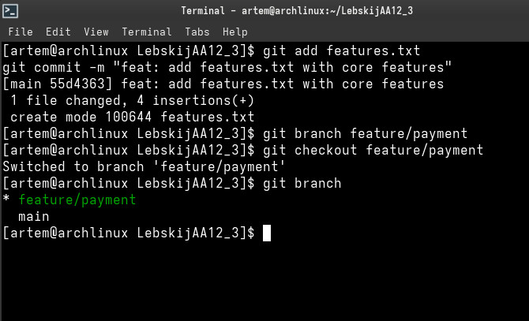

- **Скриншот 2:** Фиксация изменений в ветке `feature/payment`, возврат в `main`, создание ветки `feature/notifications` и коммит альтернативных изменений в `features.txt`.  
  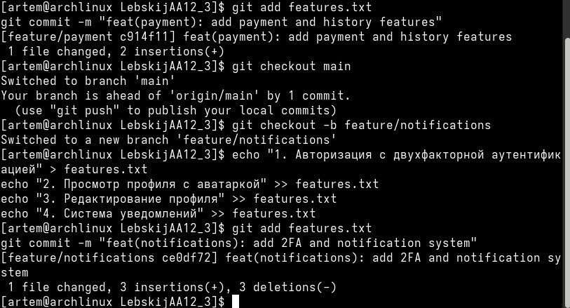

- **Скриншот 3:** Слияние ветки `feature/payment` в `main` с флагом `--no-ff` и просмотр трёхстороннего графа истории коммитов.  
  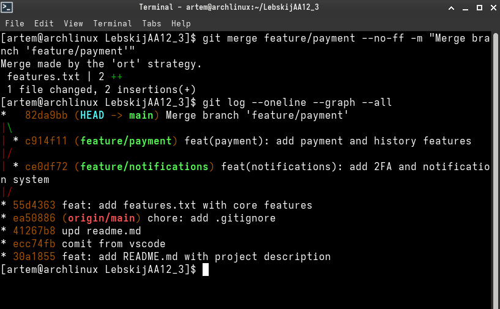

- **Скриншот 4:** Попытка слияния ветки `feature/notifications` и возникновение конфликта слияния (`CONFLICT (content)`).  
  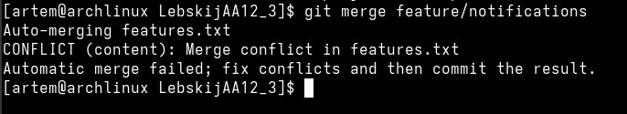

- **Скриншот 5:** Анализ неразрешённых путей через `git status` и отображение маркеров конфликта утилитой `cat features.txt`.  
  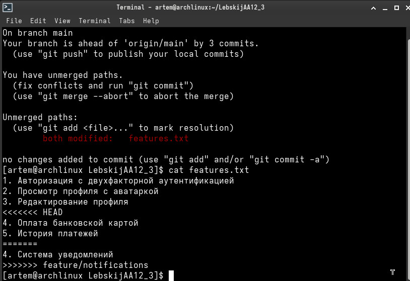

- **Скриншот 6:** Фиксация коммита разрешения конфликта и проверка обновлённой структуры графа коммитов в терминале.  
  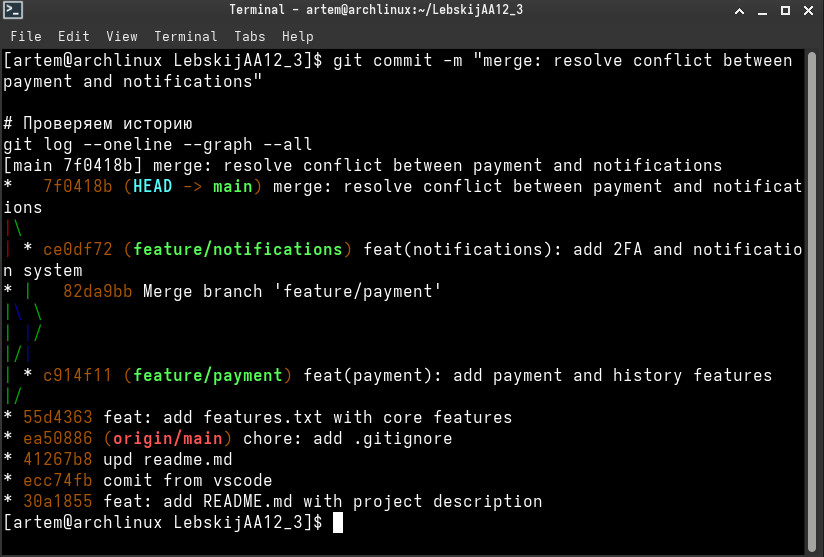

- **Скриншот 7:** Графическое отображение дерева ветвления и слияния веток в панели Source Control редактора VS Code.  
  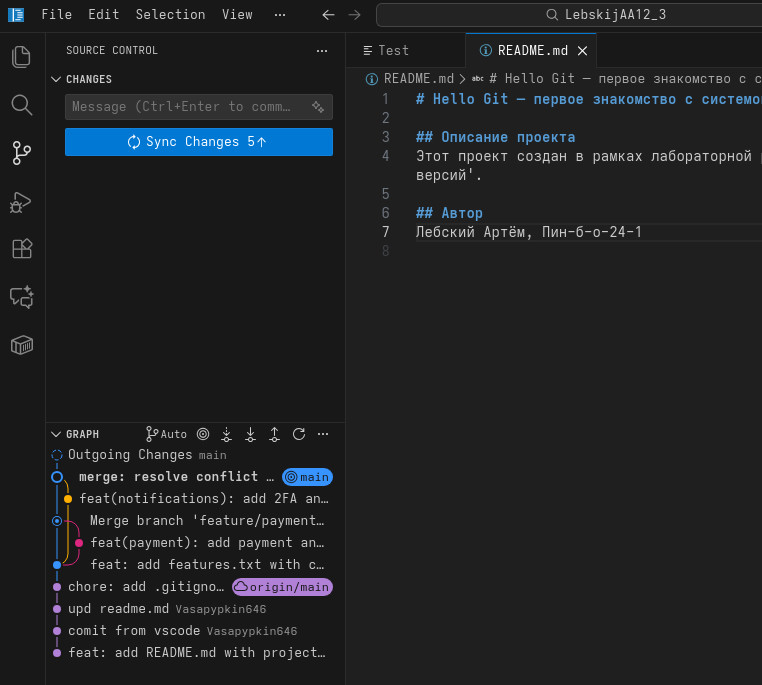

- **Скриншот 8:** Запуск операции `git rebase main` в ветке `feature/database` и обнаружение конфликта добавления файла `config.txt`.  
  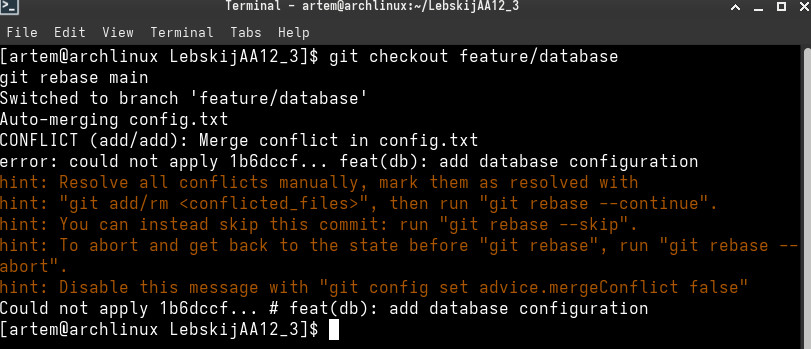

- **Скриншот 9:** Разрешение конфликта в `config.txt`, задание редактора `nano` для сообщений коммитов и успешное завершение `git rebase --continue`.  
  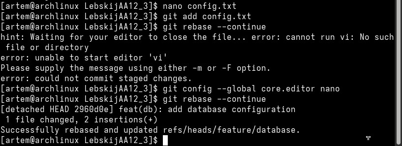

- **Скриншот 10:** Просмотр графа коммитов с линейной последовательностью ветки `feature/database` поверх `main`.  
  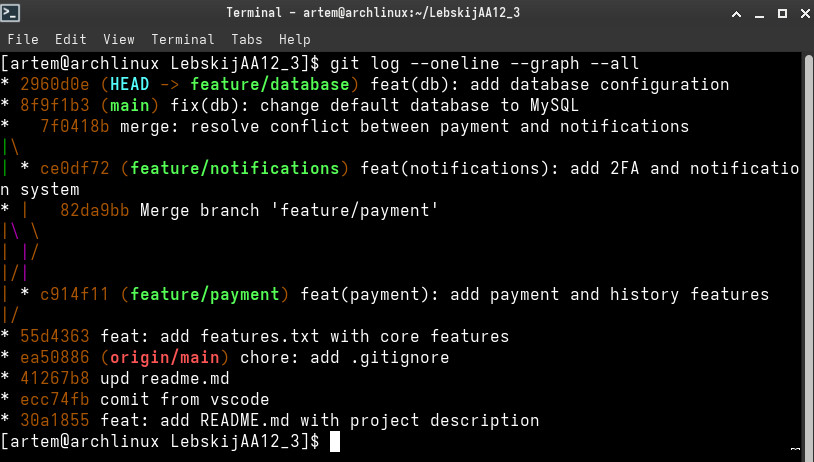

- **Скриншот 11:** Интерфейс GitLab с подтверждённым и объединённым Merge Request !1 из ветки `feature/database` в `main`.  
  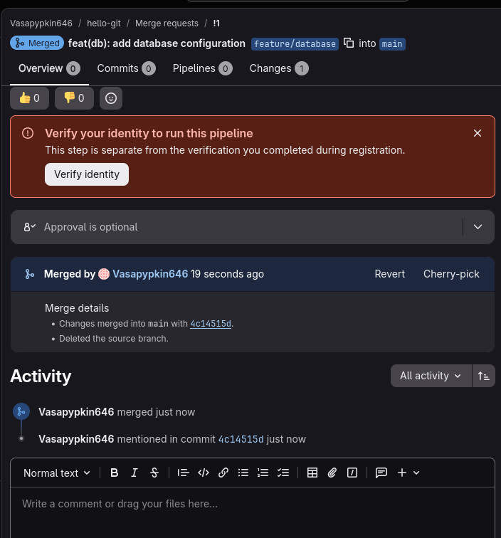

- **Скриншот 12:** Создание релизной ветки `release/v1.0`, коммит версии 1.0.0 и публикация ветки на удалённом сервере GitLab (`git push origin release/v1.0`).  
  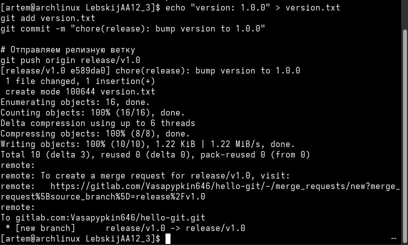

- **Скриншот 13:** Подтверждение и успешное слияние Merge Request !2 («chore(release): bump version to 1.0.0») в ветку `main` на GitLab.  
  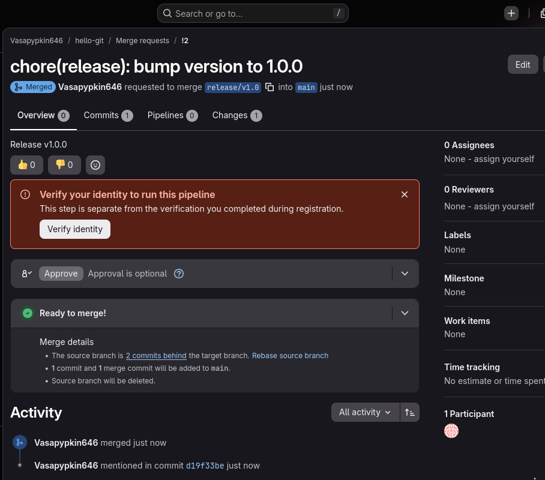

- **Скриншот 14:** Самостоятельная работа: добавление строки «первая фича» в `features.txt`, индексация и коммит `85c8724` в ветке `main`.  
  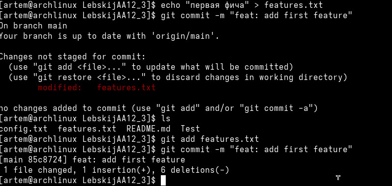

- **Скриншот 15:** Самостоятельная работа: коммит «вторая фича» в `main`, переход в ветку `feature/third` и фиксация «третья фича».  
  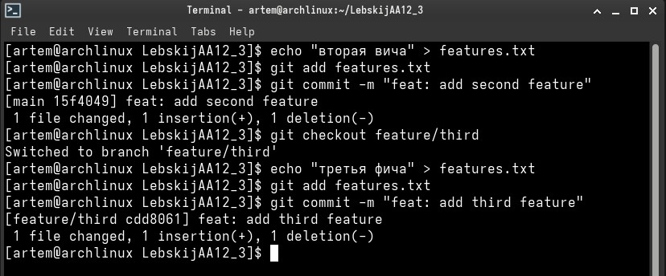

- **Скриншот 16:** Самостоятельная работа: вычисление построчной разницы между коммитами `git diff HEAD~2 HEAD` и сохранение в файл `diff.txt`.  
  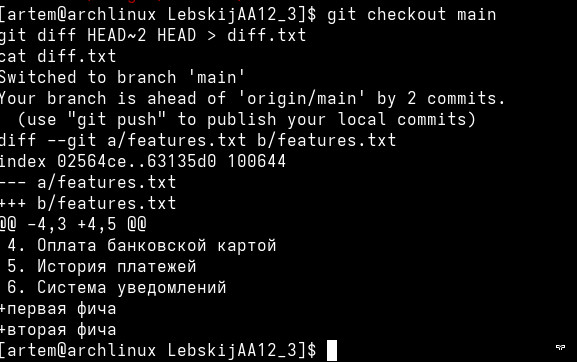

- **Скриншот 17:** Самостоятельная работа: перебазирование ветки `feature/third` на `main`, ручное устранение конфликта через `nano` и завершение `rebase`.  
  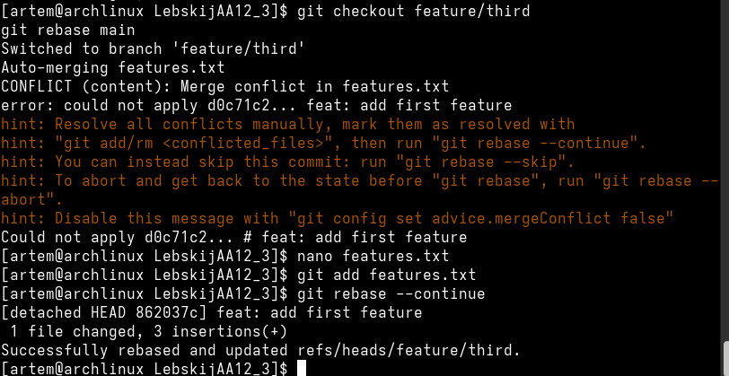

- **Скриншот 18:** Самостоятельная работа: веб-интерфейс репозитория GitLab с веткой `release`, отображением файлов проекта и финального коммита слияния.  
  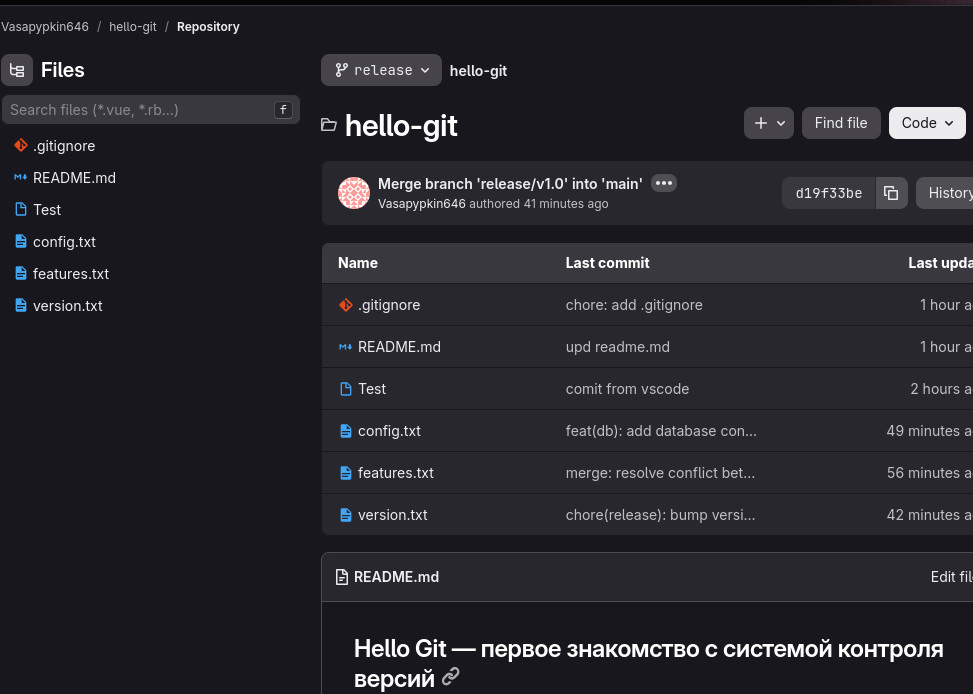

### **5\. ОТВЕТЫ НА КОНТРОЛЬНЫЕ ВОПРОСЫ**

#### **1\. Что такое ветка в Git и как она реализована технически?**

Ветка в Git — это легковесный перемещаемый указатель (ссылка) на конкретный коммит в дереве истории. Технически ветка представляет собой обычный текстовый файл размером около 41 байта, расположенный в служебном каталоге .git/refs/heads/\<имя\_ветки\>. Внутри этого файла хранится только 40-значный хэш коммита (SHA-1/SHA-256), на который указывает ветка в данный момент. При создании нового коммита Git просто перезаписывает хэш в этом файле, сдвигая указатель вперёд.

#### **2. В чём разница между git merge и git rebase? Когда что применять?**

> * git merge объединяет две ветки, сохраняя их точную историческую последовательность и создавая специальный коммит слияния (merge-коммит) с двумя родителями. История проекта становится ветвистой, но абсолютно достоверной. Применяется для интеграции готовых публичных функциональных веток в main или develop.  
> * git rebase переносит базовый коммит текущей ветки на верхушку целевой ветки, последовательно переприменяя коммиты и создавая для них новые SHA-хэши. Это даёт идеально плоскую, линейную историю без merge-коммитов. Применяется в локальных ветках до отправки на сервер, чтобы синхронизировать свою работу с актуальным состоянием main.

#### **3. Что такое конфликт слияния и как он возникает?**

Конфликт слияния — это ситуация, при которой Git не может автоматически объединить изменения из двух веток. Конфликт возникает, когда в обеих ветках были модифицированы одни и те же строки одного и того же файла (или один коммит удалил файл, а другой его отредактировал) относительно их общего предка. В этом случае Git останавливает слияние и передаёт управление разработчику для ручного разрешения.

#### **4. Как разрешить конфликт вручную? Что означают маркеры \<\<\<\<\<\<\<, \=======, \>\>\>\>\>\>\>?**

Для ручного разрешения необходимо открыть конфликтующий файл, удалить служебные маркеры и оставить требуемый итоговый вариант кода, после чего выполнить git add \<файл\> и зафиксировать результат командой git commit (или git rebase \--continue).

Значение маркеров:

> * \<\<\<\<\<\<\< HEAD — начало блока изменений из текущей ветки, в которой выполняется операция;  
> * \======= — разделитель между конфликтующими версиями;  
> * \<имя\_ветки\> — окончание блока изменений, пришедших из сливаемой (или перебазируемой) ветки.

#### **5. В чём отличие git reset от git revert? Когда какой использовать?**

> * git reset перемещает указатель текущей ветки назад во времени, отменяя коммиты (переписывая локальную историю). Применяется только для локальных коммитов, которые ещё не были отправлены в общий репозиторий.  
> * git revert не удаляет старые коммиты, а создаёт новый компенсирующий коммит, который вносит изменения, строго противоположные выбранному коммиту. Используется для публичных веток, так как не нарушает историю у других разработчиков.

#### **6. Что такое fast-forward merge и чем он отличается от трёхстороннего слияния?**

> * Fast-forward merge (перемотка вперёд) возможен, если целевая ветка не содержит новых коммитов с момента отделения сливаемой ветки. Git не создаёт отдельный коммит слияния, а просто перемещает указатель ветки вперёд к последнему коммиту сливаемой ветки.  
> * Трёхстороннее слияние (three-way merge / ort) применяется, когда ветки разошлись (в обеих есть свои уникальные коммиты). Git находит их общего предка (merge base) и объединяет изменения из двух вершин и предка, формируя новый коммит с двумя родителями.

#### **7. Зачем нужна ветка release в Git Flow?**

Ветка release (например, release/v1.0) служит буферной зоной для подготовки новой версии продукта к релизу. В ней выполняются финальная стабилизация, исправление критических дефектов, оформление документации и обновление номеров версий без блокировки разработки нового функционала другими участниками команды в ветке develop. После стабилизации релизная ветка вливается одновременно в main (с простановкой тега версии) и в develop.

#### **8. Как отправить все локальные ветки в удалённый репозиторий?**

Для отправки всех существующих локальных веток на удалённый сервер используется команда:
```
git push \--all origin
```
Для одновременной отправки всех созданных тегов версий применяется команда:
```
git push \--tags origin
```
#### **9. Почему rebase считается опасной операцией на общих ветках?**

Rebase фактически удаляет старые коммиты и генерирует вместо них новые с другими SHA-хэшами (переписывает историю). Если выполнить rebase на ветке, которую уже склонировали другие разработчики, их локальная история разойдётся с удалённой. Это потребует принудительного пуша с флагом \--force, приведёт к дублированию коммитов, сбоям при слиянии и риску потери чужих наработок. «Золотое правило Git» гласит: никогда не делать rebase на публичных общих ветках.

### **6. ИСПОЛЬЗУЕМЫЕ КОМАНДЫ**

Сводный перечень консольных команд, применённых в ходе выполнения лабораторной работы №2:
```
\# Работа с ветками (создание, переключение, просмотр)  
git branch  
git branch \<имя\_ветки\>  
git checkout \<имя\_ветки\>  
git checkout \-b \<имя\_ветки\>  
git switch \<имя\_ветки\>

\# Слияние веток и управление слиянием  
git merge \<имя\_ветки\>  
git merge \<имя\_ветки\> \--no-ff \-m "Сообщение коммита"  
git merge \--abort

\# Диагностика, сравнение и просмотр истории  
git status  
git diff  
git diff HEAD\~2 HEAD \> diff.txt  
cat \<имя\_файла\>  
git log \--oneline \--graph \--all

\# Операции перебазирования (rebase)  
git rebase \<целевая\_ветка\>  
git rebase \--continue  
git rebase \--abort  
git rebase \--skip

\# Настройка системного текстового редактора  
git config \--global core.editor nano

\# Фиксация и подготовка изменений  
git add \<имя\_файла\>  
git commit \-m "Сообщение коммита"

\# Взаимодействие с удалённым репозиторием GitLab  
git push origin \<имя\_ветки\>  
git push \-u origin main  
git push \--all origin  
git push \--tags origin
```
### **7. ВЫВОДЫ**

В ходе выполнения лабораторной работы были глубоко освоены ключевые концепции ветвления, слияния и поддержания целостности кодовой базы в системе Git:

> 1. Отработаны навыки создания и переключения параллельных изолированных веток (git branch, git checkout \-b).  
> 2. Практически изучены различия между алгоритмами слияния: трёхстороннее слияние со стратегией ort и созданием явного коммита слияния (--no-ff), а также условия возникновения fast-forward.  
> 3. Приобретён практический опыт выявления и разрешения конфликтов слияния: освоен синтаксис системных маркеров конфликта (\<\<\<\<\<\<\<, \=======, \>\>\>\>\>\>\>) и последовательность ручной правки, индексации (git add) и создания завершающего коммита.  
> 4. Успешно выполнена процедура перебазирования (git rebase), устранён конфликт одновременного добавления файла config.txt, настроен терминальный редактор nano и на практике доказана линейность результирующего графа коммитов.  
> 5. Освоен цикл работы с удалённым хостингом GitLab: отправка функциональных и релизных веток (git push origin), оформление и принятие Merge Requests (\!1 и \!2) через веб\-интерфейс, а также основы структурирования веток по методологии Git Flow.  
> 6. В рамках самостоятельной работы закреплены навыки анализа различий между коммитами через команду git diff HEAD\~2 HEAD \> diff.txt, создание ветки feature/third, разрешение конфликта при её перебазировании на main и верификация финальной структуры репозитория на сервере GitLab.