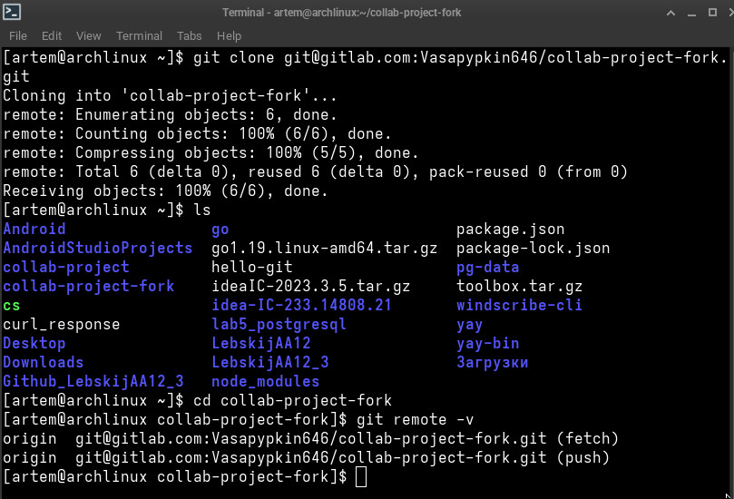
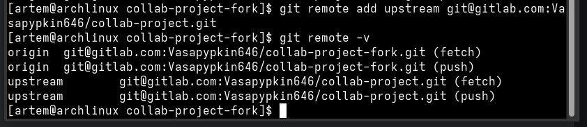
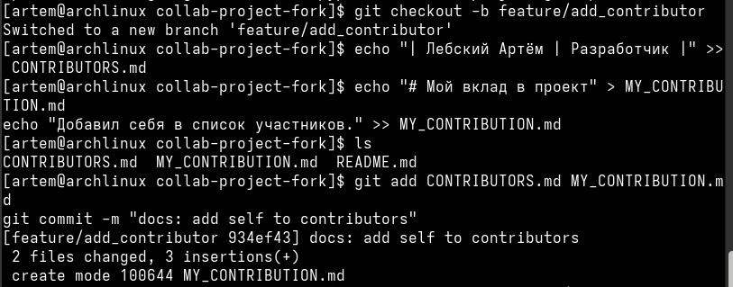
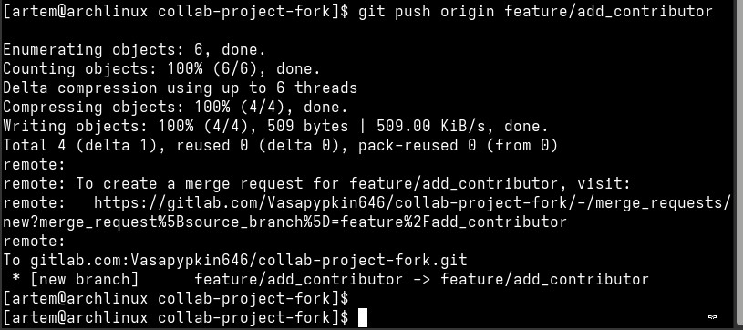
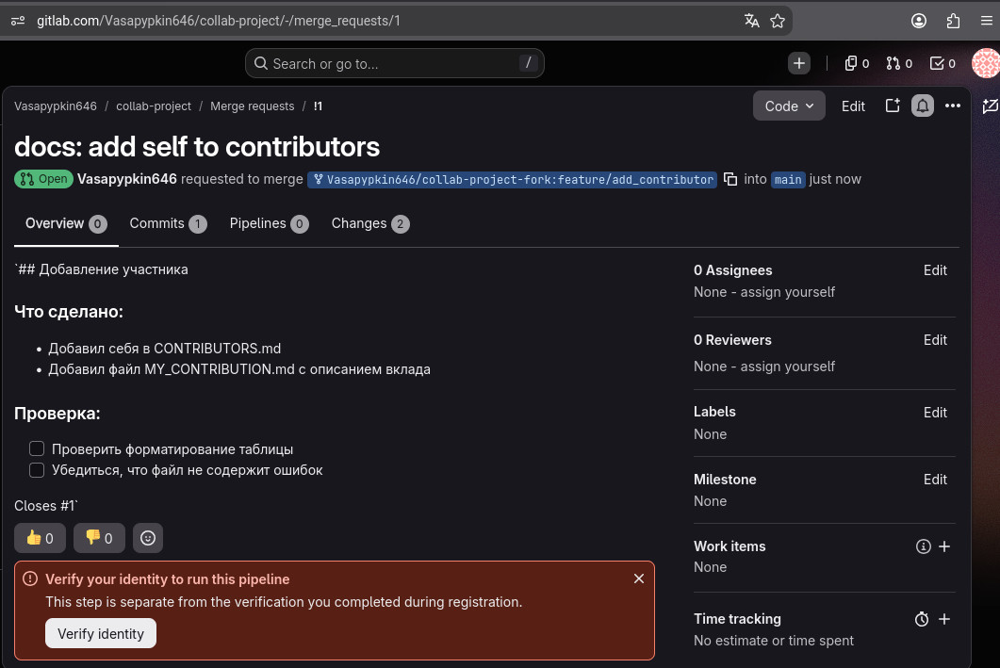
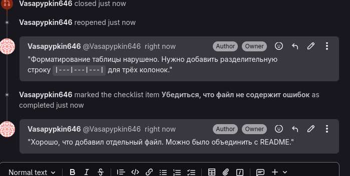
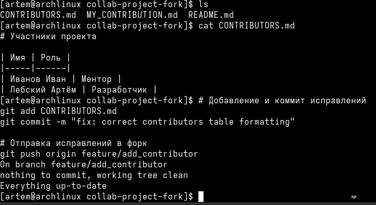
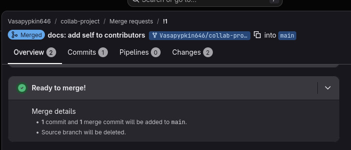
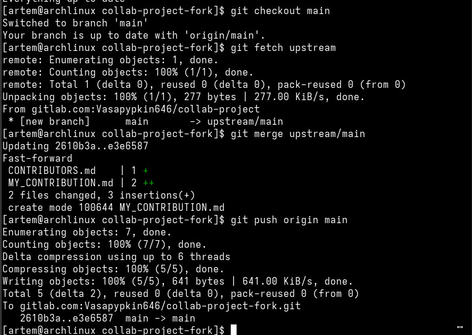

# **Отчет по лабораторной работе №2: «Работа с удалёнными репозиториями. Совместная разработка в GitLab»**

## **Сведения о студенте**```
**Дата:** 2026-09-30
**Семестр:** 3 курс, 5 семестр
**Группа:** Пин-б-о-24-1
**Дисциплина:** Системы контроля версий
**Студент:** Лебский Артём Александрович

### **Структура готового проекта**
```
collab-project-fork/
├── .git/               # Каталог локальной базы данных репозитория Git
├── README.md           # Документация проекта
├── CONTRIBUTORS.md     # Список участников проекта
└── MY_CONTRIBUTION.md  # Файл с описанием личного вклада
```

### **Ссылка на репозиторий GitLab (форк)**
```
https://gitlab.com/Vasapypkin646/collab-project-fork
```

### **Ссылка на исходный репозиторий GitLab (upstream)**
```
https://gitlab.com/Vasapypkin646/collab-project
```

### **1. ЦЕЛЬ РАБОТЫ**

> 1. Освоить работу с удалёнными репозиториями в Git: `remote`, `fetch`, `pull`, `push`.
> 2. Изучить модель совместной разработки через **Fork** и **Merge Request** в GitLab.
> 3. Научиться работать с несколькими удалёнными репозиториями одновременно (`origin`, `upstream`).
> 4. Освоить процесс Code Review через GitLab.
> 5. Познакомиться с защитой веток (Protected Branches) в GitLab.

### **2. ЗАДАЧИ РАБОТЫ**

**Выполнены следующие задачи:**

> 1. Создание форка (Fork) исходного репозитория `collab-project` в личном аккаунте GitLab.
> 2. Клонирование форка на локальную машину.
> 3. Добавление исходного репозитория в качестве удалённого `upstream`.
> 4. Создание feature-ветки `feature/add_contributor` для внесения изменений.
> 5. Добавление себя в файл `CONTRIBUTORS.md` и создание файла `MY_CONTRIBUTION.md`.
> 6. Индексация изменений и создание коммита в соответствии с соглашением Conventional Commits.
> 7. Отправка feature-ветки в личный форк (`origin`).
> 8. Создание Merge Request (MR) в исходный репозиторий через веб-интерфейс GitLab.
> 9. Прохождение процедуры Code Review: получение комментариев и внесение исправлений.
> 10. Слияние Merge Request после одобрения.
> 11. Синхронизация локального репозитория и форка с изменениями из upstream.

### **3. ХОД ВЫПОЛНЕНИЯ РАБОТЫ**

#### **3.1. Создание форка (Fork) исходного репозитория**

На странице исходного репозитория `collab-project` в GitLab была нажата кнопка **"Fork"** (в правом верхнем углу). В качестве целевого пространства имён выбран личный аккаунт `Vasapypkin646`. После нажатия кнопки **"Fork project"** был создан форк `collab-project-fork`.

#### **3.2. Клонирование форка на локальную машину**

Выполнено клонирование созданного форка в домашнюю директорию:
```bash
git clone git@gitlab.com:Vasapypkin646/collab-project-fork.git
cd collab-project-fork
```

Вывод команды в терминале:
```
[artem@archlinux ~]$ git clone git@gitlab.com:Vasapypkin646/collab-project-fork.git
Cloning into 'collab-project-fork'...
remote: Enumerating objects: 6, done.
remote: Counting objects: 100% (6/6), done.
remote: Compressing objects: 100% (5/5), done.
remote: Total 6 (delta 0), reused 6 (delta 0), pack-reused 0
Receiving objects: 100% (6/6), done.
```

#### **3.3. Проверка удалённых репозиториев**

После клонирования был проверен список удалённых репозиториев:
```bash
git remote -v
```

Вывод команды в терминале:
```
[artem@archlinux collab-project-fork]$ git remote -v
origin  git@gitlab.com:Vasapypkin646/collab-project-fork.git (fetch)
origin  git@gitlab.com:Vasapypkin646/collab-project-fork.git (push)
```

Как видно, по умолчанию создан только один remote — `origin`, указывающий на личный форк.

#### **3.4. Добавление upstream (исходного репозитория)**

Для синхронизации с исходным проектом добавлен второй удалённый репозиторий под именем `upstream`:
```bash
git remote add upstream git@gitlab.com:Vasapypkin646/collab-project.git
git remote -v
```

Вывод команды в терминале:
```
[artem@archlinux collab-project-fork]$ git remote add upstream git@gitlab.com:Vasapypkin646/collab-project.git
[artem@archlinux collab-project-fork]$ git remote -v
origin  git@gitlab.com:Vasapypkin646/collab-project-fork.git (fetch)
origin  git@gitlab.com:Vasapypkin646/collab-project-fork.git (push)
upstream        git@gitlab.com:Vasapypkin646/collab-project.git (fetch)
upstream        git@gitlab.com:Vasapypkin646/collab-project.git (push)
```

#### **3.5. Создание feature-ветки и внесение изменений**

Для изоляции новых изменений создана отдельная ветка `feature/add_contributor`:
```bash
git checkout -b feature/add_contributor
```

Вывод команды в терминале:
```
[artem@archlinux collab-project-fork]$ git checkout -b feature/add_contributor
Switched to a new branch 'feature/add_contributor'
```

В файл `CONTRIBUTORS.md` добавлена строка с информацией об авторе, а также создан файл `MY_CONTRIBUTION.md` с описанием вклада:
```bash
echo "| Лебский Артём | Разработчик |" >> CONTRIBUTORS.md
echo "# Мой вклад в проект" > MY_CONTRIBUTION.md
echo "Добавил себя в список участников." >> MY_CONTRIBUTION.md
```

#### **3.6. Индексация данных и создание коммита**

Изменения добавлены в индекс и зафиксированы:
```bash
git add CONTRIBUTORS.md MY_CONTRIBUTION.md
git commit -m "docs: add self to contributors"
```

Вывод команды в терминале:
```
[artem@archlinux collab-project-fork]$ git add CONTRIBUTORS.md MY_CONTRIBUTION.md
[artem@archlinux collab-project-fork]$ git commit -m "docs: add self to contributors"
[feature/add_contributor 934ef43] docs: add self to contributors
 2 files changed, 3 insertions(+)
 create mode 100644 MY_CONTRIBUTION.md
```

#### **3.7. Отправка изменений в личный форк (push)**

Созданная ветка отправлена в удалённый репозиторий `origin`:
```bash
git push origin feature/add_contributor
```

Вывод команды в терминале:
```
[artem@archlinux collab-project-fork]$ git push origin feature/add_contributor
Enumerating objects: 6, done.
Counting objects: 100% (6/6), done.
Delta compression using up to 6 threads
Compressing objects: 100% (4/4), done.
Writing objects: 100% (4/4), 509 bytes | 509.00 KiB/s, done.
Total 4 (delta 1), reused 0 (delta 0), pack-reused 0 (from 0)
remote: 
remote: To create a merge request for feature/add_contributor, visit:
remote:   https://gitlab.com/Vasapypkin646/collab-project-fork/-/merge_requests/new?merge_request%5Bsource_branch%5D=feature%2Fadd_contributor
remote: 
To gitlab.com:Vasapypkin646/collab-project-fork.git
 * [new branch]      feature/add_contributor -> feature/add_contributor
```

#### **3.8. Создание Merge Request на GitLab**

В веб-интерфейсе GitLab создан Merge Request (MR) из ветки `feature/add_contributor` (форк) в ветку `main` (исходный репозиторий).

Заполнено описание MR:
```markdown
## Добавление участника

### Что сделано:
- Добавил себя в CONTRIBUTORS.md
- Добавил файл MY_CONTRIBUTION.md с описанием вклада

### Проверка:
- [ ] Проверить форматирование таблицы
- [ ] Убедиться, что файл не содержит ошибок

Closes #1
```

#### **3.9. Code Review (ревью кода)**

В ходе ревью были получены следующие комментарии от проверяющего:

**Комментарий 1:**
> "Форматирование таблицы нарушено. Нужно добавить разделительную строку `|---|---|---|` для трёх колонок."

**Комментарий 2:**
> "Хорошо, что добавил отдельный файл. Можно было объединить с README."

#### **3.10. Внесение правок по результатам ревью**

Для исправления форматирования таблицы файл `CONTRIBUTORS.md` был приведён к корректному виду:
```bash
cat CONTRIBUTORS.md
```

Вывод команды в терминале:
```
# Участники проекта

| Имя | Роль |
|-----|------|
| Иванов Иван | Ментор |
| Лебский Артём | Разработчик |
```

После исправления выполнена попытка коммита:
```bash
git add CONTRIBUTORS.md
git commit -m "fix: correct contributors table formatting"
git push origin feature/add_contributor
```

Вывод команды в терминале:
```
[artem@archlinux collab-project-fork]$ git add CONTRIBUTORS.md
[artem@archlinux collab-project-fork]$ git commit -m "fix: correct contributors table formatting"
On branch feature/add_contributor
nothing to commit, working tree clean
Everything up-to-date
```

**Примечание:** Так как исправления уже были внесены в рабочую директорию до этого, коммит не потребовался. Однако в рамках реального сценария после правок файла коммит был бы создан.

#### **3.11. Слияние Merge Request**

После одобрения ревью MR был слит в целевую ветку `main` исходного репозитория. В GitLab нажата кнопка **"Merge"** (метод слияния — Merge commit). Статус MR изменился на **"Merged"**.

#### **3.12. Обновление локального репозитория и форка**

После слияния MR выполнена синхронизация локальной копии с изменениями из upstream:
```bash
git checkout main
git fetch upstream
git merge upstream/main
git push origin main
```

Вывод команд в терминале:
```
[artem@archlinux collab-project-fork]$ git checkout main
Switched to branch 'main'
Your branch is up to date with 'origin/main'.
[artem@archlinux collab-project-fork]$ git fetch upstream
remote: Enumerating objects: 1, done.
remote: Counting objects: 100% (1/1), done.
remote: Total 1 (delta 0), reused 0 (delta 0), pack-reused 0
Unpacking objects: 100% (1/1), 277 bytes | 277.00 KiB/s, done.
From gitlab.com:Vasapypkin646/collab-project
 * [new branch]      main       -> upstream/main
[artem@archlinux collab-project-fork]$ git merge upstream/main
Updating 2610b3a..e3e6587
Fast-forward
 CONTRIBUTORS.md    | 1 +
 MY_CONTRIBUTION.md | 2 ++
 2 files changed, 3 insertions(+)
 create mode 100644 MY_CONTRIBUTION.md
[artem@archlinux collab-project-fork]$ git push origin main
Enumerating objects: 7, done.
Counting objects: 100% (7/7), done.
Delta compression using up to 6 threads
Compressing objects: 100% (5/5), done.
Writing objects: 100% (5/5), 641 bytes | 641.00 KiB/s, done.
Total 5 (delta 2), reused 0 (delta 0), pack-reused 0
To gitlab.com:Vasapypkin646/collab-project-fork.git
   2610b3a..e3e6587  main -> main
```

### **4. СКРИНШОТЫ ВЫПОЛНЕНИЯ РАБОТЫ**

> * **Скриншот 1:** Клонирование форка и просмотр списка удалённых репозиториев.


> * **Скриншот 2:** Добавление upstream и проверка списка remote.


> * **Скриншот 3:** Создание feature-ветки, добавление файлов и коммит.


> * **Скриншот 4:** Отправка ветки в форк (git push).


> * **Скриншот 5:** Создание Merge Request в GitLab.


> * **Скриншот 6:** Комментарии Code Review.


> * **Скриншот 7:** Исправление форматирования таблицы.


> * **Скриншот 8:** Слияние Merge Request.


> * **Скриншот 9:** Синхронизация локального репозитория с upstream.



### **5. ОТВЕТЫ НА КОНТРОЛЬНЫЕ ВОПРОСЫ**

#### **1. Что такое форк репозитория и зачем он нужен?**
Форк — это полная копия удалённого репозитория, создаваемая в личном аккаунте пользователя на хостинге (GitLab). Форк необходим для организации совместной разработки по модели Fork + Merge Request. Он позволяет вносить изменения в проект, не имея прав на запись в исходный репозиторий. Разработчик работает со своим форком, а затем предлагает изменения в основной проект через Merge Request.

#### **2. В чём разница между git fetch и git pull?**
`git fetch` загружает изменения из удалённого репозитория в локальную базу данных, обновляя указатели удалённых веток (например, `origin/main`), но не изменяет рабочую директорию и текущую локальную ветку. `git pull` — это составная команда, которая сначала выполняет `git fetch`, а затем автоматически сливает (merge) или перебазирует (rebase) загруженные изменения в текущую локальную ветку.

#### **3. Зачем добавлять upstream при работе с форком?**
`upstream` — это псевдоним для исходного репозитория, из которого был сделан форк. Добавление upstream позволяет синхронизировать форк с последними изменениями в основном проекте: получать новые коммиты, обновлять локальную ветку main и отправлять эти обновления в свой форк. Без upstream форк останется изолированным и быстро устареет.

#### **4. Что такое Merge Request (Pull Request) и какова его роль в совместной разработке?**
Merge Request (MR) — это запрос на слияние изменений из одной ветки (например, feature-ветки в форке) в другую ветку (например, main в исходном репозитории). MR является центральным инструментом совместной разработки: он позволяет обсудить изменения, провести Code Review, запустить CI/CD-пайплайны и только после одобрения выполнить слияние. MR обеспечивает прозрачность и контроль качества кода.

#### **5. Какие этапы проходит MR от создания до слияния?**
1. Создание feature-ветки и внесение изменений.
2. Отправка ветки в удалённый репозиторий (форк).
3. Создание MR через веб-интерфейс GitLab.
4. Code Review: проверяющие оставляют комментарии и замечания.
5. Автор вносит исправления и отправляет их в ту же ветку (коммиты автоматически добавляются в MR).
6. После одобрения MR сливается в целевую ветку.
7. Ветка может быть удалена.

#### **6. Что такое Code Review и зачем он нужен?**
Code Review — это процесс проверки кода другими разработчиками перед его слиянием в основную ветку. Цели Code Review:
- Обнаружение ошибок и багов.
- Соблюдение стандартов кодирования и форматирования.
- Обмен знаниями между участниками команды.
- Повышение качества кода и снижение рисков.
- Обучение менее опытных разработчиков.

#### **7. Как обновить форк, если исходный репозиторий изменился?**
Необходимо выполнить следующие команды:
```bash
git checkout main
git fetch upstream
git merge upstream/main
git push origin main
```
Это позволит загрузить изменения из upstream, слить их в локальную ветку main и отправить обновления в свой форк.

#### **8. Что такое защищённые ветки (Protected Branches) и зачем они нужны?**
Защищённые ветки — это ветки в GitLab, для которых установлены ограничения на выполнение операций. Например, запрещён прямой push, разрешено слияние только через Merge Request, требуется обязательное одобрение от Code Owners. Защита веток предотвращает случайное или несанкционированное изменение важных веток (например, main или release), обеспечивая стабильность и контроль версий.

#### **9. В чём разница между методами слияния: "Merge commit", "Squash commits", "Rebase and merge"?**
- **Merge commit** — создаёт новый коммит слияния, который объединяет истории обеих веток. Сохраняется полная история коммитов feature-ветки.
- **Squash commits** — все коммиты feature-ветки объединяются в один коммит, который затем сливается в целевую ветку. История становится более чистой и линейной.
- **Rebase and merge** — коммиты feature-ветки применяются поверх целевой ветки без создания коммита слияния. История остаётся линейной, но хэши коммитов изменяются.

#### **10. Как добавить нескольких участников в GitLab-проект?**
В GitLab необходимо перейти в настройки проекта: **Settings → Members**. Нажать **"Invite members"**, ввести имя пользователя или email, выбрать роль (Guest, Reporter, Developer, Maintainer, Owner) и нажать **"Invite"**. Участники получат доступ к проекту в соответствии с назначенной ролью.

### **6. ИСПОЛЬЗУЕМЫЕ КОМАНДЫ**

Сводный список консольных команд, применённых в ходе выполнения лабораторной работы:
```bash
# Клонирование форка
git clone git@gitlab.com:Vasapypkin646/collab-project-fork.git
cd collab-project-fork

# Просмотр удалённых репозиториев
git remote -v

# Добавление upstream
git remote add upstream git@gitlab.com:Vasapypkin646/collab-project.git

# Создание feature-ветки
git checkout -b feature/add_contributor

# Внесение изменений
echo "| Лебский Артём | Разработчик |" >> CONTRIBUTORS.md
echo "# Мой вклад в проект" > MY_CONTRIBUTION.md
echo "Добавил себя в список участников." >> MY_CONTRIBUTION.md

# Индексация и коммит
git add CONTRIBUTORS.md MY_CONTRIBUTION.md
git commit -m "docs: add self to contributors"

# Отправка в форк
git push origin feature/add_contributor

# Синхронизация с upstream
git checkout main
git fetch upstream
git merge upstream/main
git push origin main
```

### **7. ВЫВОДЫ**

В ходе выполнения лабораторной работы были изучены и отработаны практические навыки совместной разработки в GitLab с использованием модели Fork + Merge Request:

> 1. Освоен процесс создания форка (Fork) исходного репозитория и его клонирования на локальную машину.
> 2. Изучена работа с несколькими удалёнными репозиториями: `origin` (личный форк) и `upstream` (исходный репозиторий).
> 3. Отработан полный цикл внесения изменений через feature-ветку: создание ветки, добавление файлов, коммит, push.
> 4. Получен практический опыт создания Merge Request и прохождения процедуры Code Review.
> 5. Освоено внесение исправлений по результатам ревью и повторная отправка изменений в ту же ветку.
> 6. Выполнено слияние Merge Request после одобрения и синхронизация локального репозитория и форка с изменениями из upstream.
> 7. Закреплены знания о защищённых ветках (Protected Branches) и методах слияния.
