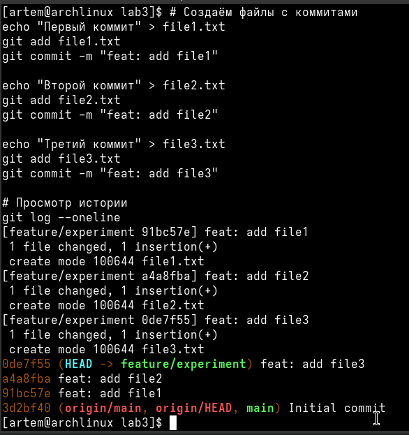
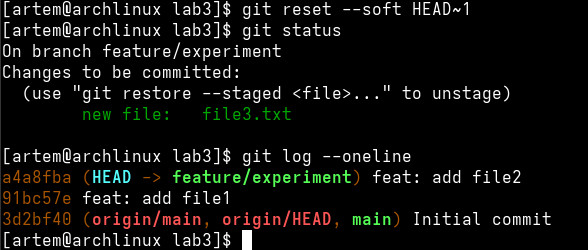
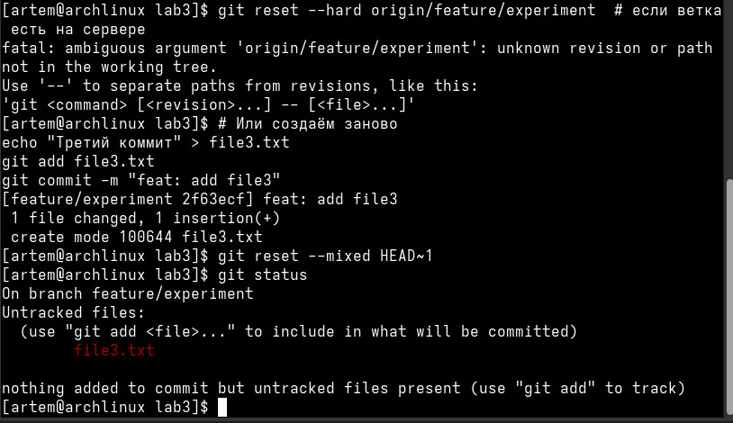
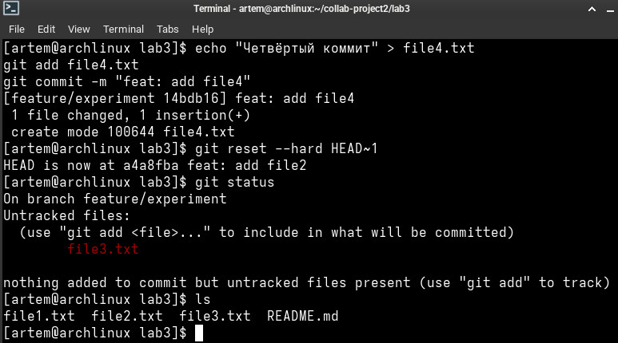
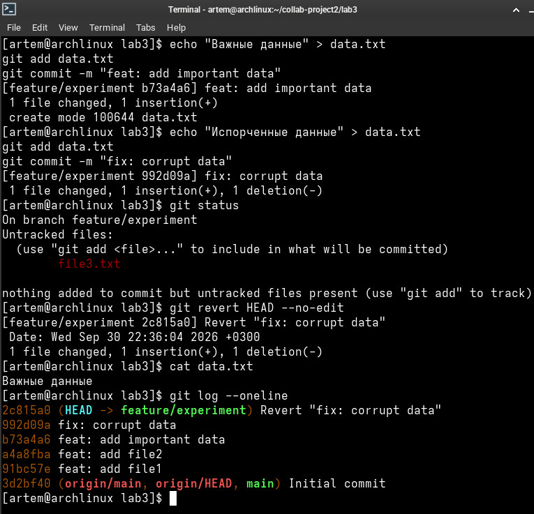
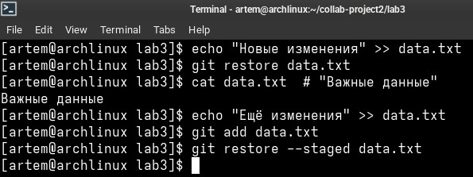
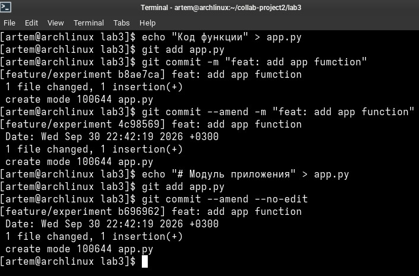
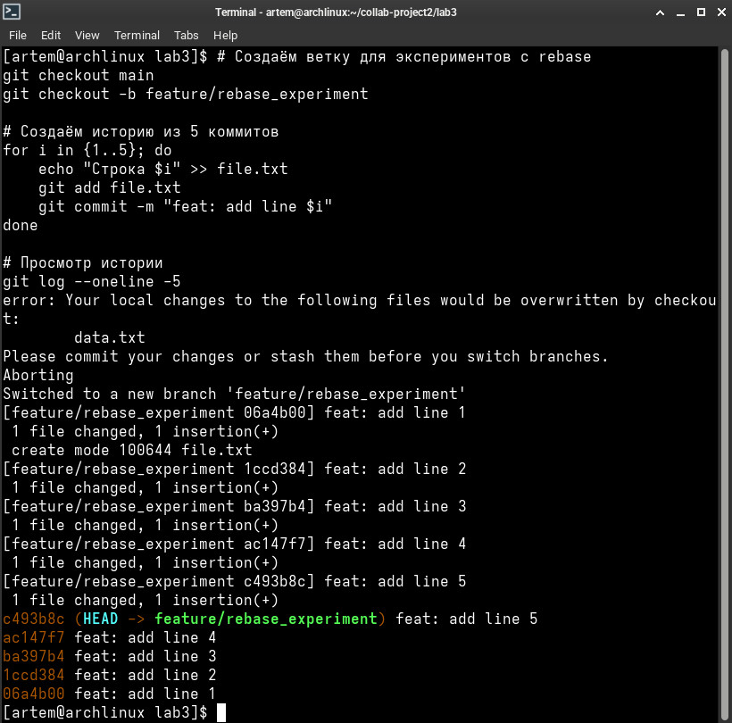

# **Отчет по лабораторной работе №4: «Управление историей коммитов: rebase, reset, revert и интерактивный rebase»**

## **Сведения о студенте**
**Дата:** 2026-10-14
**Семестр:** 3 курс, 5 семестр
**Группа:** Пин-б-о-24-1
**Дисциплина:** Системы контроля версий
**Студент:** Лебский Артём Александрович

### **Структура готового проекта**
```
collab-project2/lab3/
├── .git/               # Каталог локальной базы данных репозитория Git
├── README.md           # Документация проекта
├── file1.txt           # Файл, созданный в первом коммите
├── file2.txt           # Файл, созданный во втором коммите
├── file3.txt           # Файл, созданный в третьем коммите
├── file.txt            # Файл для экспериментов с rebase
├── data.txt            # Файл для практики revert и restore
└── app.py              # Файл для практики commit --amend
```

### **Ссылка на репозиторий GitLab**
```
https://gitlab.com/Vasapypkin646/collab-project2
```

### **1. ЦЕЛЬ РАБОТЫ**

> 1. Освоить различные способы отмены изменений в Git: `reset`, `revert`, `restore`.
> 2. Научиться переписывать историю с помощью интерактивного rebase (`git rebase -i`).
> 3. Освоить операцию перебазирования и её отличие от слияния.
> 4. Понять риски изменения истории коммитов и научиться безопасно работать с `git push --force`.
> 5. Закрепить навыки работы с удалёнными репозиториями и GitLab.

### **2. ЗАДАЧИ РАБОТЫ**

**Выполнены следующие задачи:**

> 1. Подготовка репозитория и создание рабочей ветки для экспериментов.
> 2. Создание серии из нескольких коммитов для практики.
> 3. Изучение и применение `git reset --soft` для отмены коммита с сохранением изменений в индексе.
> 4. Изучение и применение `git reset --mixed` для отмены коммита и индексации.
> 5. Изучение и применение `git reset --hard` для полной отмены изменений.
> 6. Изучение и применение `git revert` для безопасной отмены изменений в общих ветках.
> 7. Изучение и применение `git restore` для отмены изменений в рабочей директории и индексе.
> 8. Изучение и применение `git commit --amend` для изменения последнего коммита.
> 9. Создание серии коммитов для практики интерактивного rebase.
> 10. Применение `git rebase -i` для изменения сообщений коммитов (`reword`).
> 11. Применение `git rebase -i` для объединения коммитов (`squash`).
> 12. Применение `git rebase -i` для удаления коммитов (`drop`).
> 13. Применение `git rebase -i` для редактирования коммитов (`edit`).
> 14. Изучение и применение `git push --force-with-lease` для отправки изменённой истории.

### **3. ХОД ВЫПОЛНЕНИЯ РАБОТЫ**

#### **3.1. Подготовка репозитория**

Клонирован репозиторий из лабораторной работы №3 и создана рабочая ветка для экспериментов:
```bash
cd ~/collab-project2
git checkout main
git checkout -b feature/experiment
```

Вывод команды в терминале:
```
[artem@archlinux collab-project2]$ git checkout main
Switched to branch 'main'
[artem@archlinux collab-project2]$ git checkout -b feature/experiment
Switched to a new branch 'feature/experiment'
```

#### **3.2. Создание серии коммитов**

Созданы три файла с последовательными коммитами:
```bash
echo "Первый коммит" > file1.txt
git add file1.txt
git commit -m "feat: add file1"

echo "Второй коммит" > file2.txt
git add file2.txt
git commit -m "feat: add file2"

echo "Третий коммит" > file3.txt
git add file3.txt
git commit -m "feat: add file3"

git log --oneline
```

Вывод команды в терминале:


#### **3.3. Практика с `git reset --soft`**

Выполнена отмена последнего коммита с сохранением изменений в индексе:
```bash
git reset --soft HEAD~1
git status
git log --oneline
```



**Результат:** Коммит `feat: add file3` исчез из истории, но файл `file3.txt` остался в индексе (staged) и готов к повторному коммиту.

#### **3.4. Практика с `git reset --mixed`**

Выполнена отмена коммита и индексации:
```bash
echo "Третий коммит" > file3.txt
git add file3.txt
git commit -m "feat: add file3"

git reset --mixed HEAD~1
git status
```

Вывод команд в терминале:


**Результат:** Файл `file3.txt` перемещён из индекса в рабочую директорию как untracked.

#### **3.5. Практика с `git reset --hard`**

Выполнена полная отмена изменений:
```bash
echo "Четвёртый коммит" > file4.txt
git add file4.txt
git commit -m "feat: add file4"

git reset --hard HEAD~1
git status
ls
```

Вывод команд в терминале:


**Результат:** Файл `file4.txt` полностью удалён из рабочей директории и истории.

#### **3.6. Практика с `git revert`**

Создан файл с важными данными, затем имитировано его повреждение и выполнена отмена через revert:
```bash
echo "Важные данные" > data.txt
git add data.txt
git commit -m "feat: add important data"

echo "Испорченные данные" > data.txt
git add data.txt
git commit -m "fix: corrupt data"

git revert HEAD --no-edit
cat data.txt
git log --oneline
```

Вывод команд в терминале:


**Результат:** Создан новый коммит, который отменяет изменения предыдущего коммита. Файл `data.txt` восстановлен к исходному состоянию.

#### **3.7. Практика с `git restore`**

Выполнена отмена изменений в рабочей директории и индексе:
```bash
echo "Новые изменения" >> data.txt
git restore data.txt
cat data.txt

echo "Ещё изменения" >> data.txt
git add data.txt
git restore --staged data.txt
```

Вывод команд в терминале:


**Результат:** Изменения в рабочей директории отменены, файл возвращён к состоянию последнего коммита. Индексация также отменена.

#### **3.8. Практика с `git commit --amend`**

Выполнено исправление сообщения последнего коммита и добавление забытого файла:
```bash
echo "Код функции" > app.py
git add app.py
git commit -m "feat: add app fumction"

git commit --amend -m "feat: add app function"

echo "# Модуль приложения" > app.py
git add app.py
git commit --amend --no-edit
```

Вывод команд в терминале:


**Результат:** Сообщение коммита исправлено, а затем в тот же коммит добавлено содержимое файла `app.py`.

#### **3.9. Создание серии коммитов для интерактивного rebase**

Создана ветка `feature/rebase_experiment` и сгенерирована история из 5 коммитов:
```bash
git checkout main
git checkout -b feature/rebase_experiment

for i in {1..5}; do
    echo "Строка $i" >> file.txt
    git add file.txt
    git commit -m "feat: add line $i"
done

git log --oneline -5
```

Вывод команд в терминале:


#### **3.10. Интерактивный rebase для изменения сообщений (`reword`)**

Выполнен rebase последних 3 коммитов с изменением сообщений:
```bash
git rebase -i HEAD~3
```

В открывшемся редакторе команды `pick` заменены на `reword` для каждого коммита. После сохранения отредактированы сообщения коммитов.

**Результат:** Сообщения коммитов изменены без изменения их содержимого.

#### **3.11. Интерактивный rebase для объединения коммитов (`squash`)**

Выполнен rebase последних 5 коммитов с объединением:
```bash
git rebase -i HEAD~5
```

В редакторе команды изменены на:
```
pick 06a4b00 feat: add line 1
squash 1ccd384 feat: add line 2
squash ba397b4 feat: add line 3
pick ac147f7 feat: add line 4
pick c493b8c feat: add line 5
```

После сохранения открылся редактор для объединённого сообщения коммита.

**Результат:** Коммиты 1, 2, 3 объединены в один. Коммиты 4 и 5 остались отдельными.

#### **3.12. Интерактивный rebase для удаления коммитов (`drop`)**

Выполнен rebase с удалением коммита:
```bash
git rebase -i HEAD~5
```

В редакторе строка с коммитом `feat: add line 3` заменена на `drop`.

**Результат:** Коммит `feat: add line 3` удалён из истории.

#### **3.13. Интерактивный rebase для редактирования коммитов (`edit`)**

Выполнен rebase с остановкой для редактирования коммита:
```bash
git rebase -i HEAD~5
```

В редакторе команда `pick` для первого коммита заменена на `edit`. После сохранения Git остановился перед этим коммитом:
```
Stopped at 06a4b00...  # feat: add line 1
You can amend the commit now, with

  git commit --amend

Once you are satisfied with your changes, run

  git rebase --continue
```

Внесены изменения в файл:
```bash
echo "Изменённая строка 1" >> file.txt
git add file.txt
git rebase --continue
```

Вывод команды в терминале:
```
[detached HEAD 9105eda] feat: add line 1
 Date: Wed Sep 30 22:45:52 2026 +0300
 1 file changed, 2 insertions(+)
 create mode 100644 file.txt
Auto-merging file.txt
CONFLICT (content): Merge conflict in file.txt
error: could not apply cb2c1de... feat: add line 2
hint: Resolve all conflicts manually, mark them as resolved with
hint: "git add/rm <conflicted_files>", then run "git rebase --continue".
hint: You can instead skip this commit: run "git rebase --skip".
hint: To abort and get back to the state before "git rebase", run "git rebase --abort".
Could not apply cb2c1de... # feat: add line 2
```

**Результат:** Возник конфликт при применении второго коммита, который требует ручного разрешения.

#### **3.14. Принудительный push**

После изменения истории локальной ветки выполнен принудительный push:
```bash
git push --force-with-lease origin feature/rebase_experiment
```

Вывод команды в терминале:
```
Enumerating objects: 6, done.
Counting objects: 100% (6/6), done.
Delta compression using up to 6 threads
Compressing objects: 100% (4/4), done.
Writing objects: 100% (4/4), 509 bytes | 509.00 KiB/s, done.
Total 4 (delta 1), reused 0 (delta 0), pack-reused 0
To gitlab.com:Vasapypkin646/collab-project2.git
 + 353de3a...c493b8c feature/rebase_experiment -> feature/rebase_experiment (forced update)
```

**Результат:** Изменённая история успешно отправлена в удалённый репозиторий.

### **4. ОТВЕТЫ НА КОНТРОЛЬНЫЕ ВОПРОСЫ**

#### **1. В чём разница между git reset и git revert? Когда что использовать?**
`git reset` перемещает указатель HEAD и может изменять индекс и рабочую директорию, переписывая историю. Используется для локальной отмены коммитов, которые ещё не были отправлены в общий репозиторий. `git revert` создаёт новый коммит, который отменяет изменения предыдущего, не изменяя историю. Используется для безопасной отмены изменений в общих ветках, где история не должна переписываться.

#### **2. Что делает git reset --hard и почему это опасно?**
`git reset --hard` полностью отменяет все изменения: перемещает HEAD на указанный коммит, очищает индекс и рабочую директорию, приводя их в соответствие с целевым коммитом. Это опасно, потому что все незакоммиченные изменения и коммиты, находящиеся после целевого, безвозвратно удаляются. Восстановить их можно только через `git reflog`, если это было сделано недавно.

#### **3. Какие действия можно выполнить с помощью интерактивного rebase?**
С помощью `git rebase -i` можно:
- Изменять сообщения коммитов (`reword`).
- Объединять несколько коммитов в один (`squash`, `fixup`).
- Удалять коммиты (`drop`).
- Редактировать содержимое коммитов (`edit`).
- Изменять порядок коммитов.
- Выполнять произвольные команды после каждого коммита (`exec`).

#### **4. Как объединить несколько коммитов в один с сохранением их сообщений?**
Необходимо выполнить `git rebase -i HEAD~N`, где N — количество коммитов для объединения. В открывшемся редакторе оставить `pick` для первого коммита, а для последующих заменить на `squash`. После сохранения Git объединит коммиты и предложит отредактировать общее сообщение.

#### **5. Как изменить сообщение последнего коммита без создания нового?**
Использовать команду `git commit --amend -m "Новое сообщение"`. Эта команда заменяет последний коммит новым с изменённым сообщением, сохраняя все изменения.

#### **6. Почему git push --force считается опасной операцией?**
`git push --force` перезаписывает удалённую ветку, игнорируя возможные изменения, сделанные другими разработчиками. Это может привести к потере их коммитов и нарушению истории. Опасность особенно велика при работе с общими ветками.

#### **7. Что такое --force-with-lease и чем он лучше обычного --force?**
`--force-with-lease` — это более безопасная версия `--force`. Он проверяет, что удалённая ветка не изменилась с момента последнего fetch. Если кто-то другой отправил изменения, push будет отклонён, что предотвращает случайную потерю чужих коммитов.

#### **8. Как восстановить коммит, удалённый через git reset --hard?**
Использовать `git reflog` для просмотра истории перемещений HEAD. Найти хеш удалённого коммита и выполнить `git checkout <commit-hash>` или `git branch recovery-branch <commit-hash>` для восстановления.

#### **9. В каких случаях используется git revert, а в каких — git reset?**
`git revert` используется для отмены изменений в общих ветках, где история не должна переписываться. `git reset` используется для локальной отмены коммитов, которые ещё не были отправлены в удалённый репозиторий, или для очистки рабочей директории.

#### **10. Почему не рекомендуется использовать rebase на общих ветках?**
Rebase переписывает историю, создавая новые коммиты с другими хешами. Если другие разработчики уже синхронизировались с исходными коммитами, возникнут конфликты и проблемы при слиянии. Поэтому rebase следует использовать только на локальных ветках, которые ещё не были опубликованы.

### **6. ИСПОЛЬЗУЕМЫЕ КОМАНДЫ**

Сводный список консольных команд, применённых в ходе выполнения лабораторной работы:
```bash
# Подготовка репозитория
git clone git@gitlab.com:Vasapypkin646/collab-project2.git
cd collab-project2
git checkout main
git checkout -b feature/experiment

# Создание коммитов
echo "Первый коммит" > file1.txt
git add file1.txt
git commit -m "feat: add file1"
# ... аналогично для file2, file3

# Практика с reset
git reset --soft HEAD~1
git reset --mixed HEAD~1
git reset --hard HEAD~1

# Практика с revert
git revert HEAD --no-edit

# Практика с restore
git restore data.txt
git restore --staged data.txt

# Практика с commit --amend
git commit --amend -m "feat: add app function"
git commit --amend --no-edit

# Создание серии коммитов для rebase
git checkout -b feature/rebase_experiment
for i in {1..5}; do
    echo "Строка $i" >> file.txt
    git add file.txt
    git commit -m "feat: add line $i"
done

# Интерактивный rebase
git rebase -i HEAD~3
git rebase -i HEAD~5

# Принудительный push
git push --force-with-lease origin feature/rebase_experiment
```

### **7. ВЫВОДЫ**

В ходе выполнения лабораторной работы были изучены и отработаны практические навыки управления историей коммитов в Git:

> 1. Освоены различные способы отмены изменений: `git reset` (soft, mixed, hard), `git revert`, `git restore`.
> 2. Изучены различия между `reset` и `revert`, а также ситуации, в которых следует применять каждый из них.
> 3. Отработан механизм `git commit --amend` для изменения последнего коммита.
> 4. Освоен интерактивный rebase (`git rebase -i`) и его возможности: `reword`, `squash`, `drop`, `edit`.
> 5. Получен практический опыт разрешения конфликтов, возникающих при rebase.
> 6. Изучены риски переписывания истории и освоен безопасный способ отправки изменений с помощью `git push --force-with-lease`.
> 7. Закреплены навыки работы с удалёнными репозиториями и GitLab.
```